# The Hub

A personal command center that gives you one place to find, preview, and navigate your workspace — from your browser, terminal, or any AI tool.

Point it at your directories. It scans your files, groups them by pattern, and surfaces everything in a searchable, AI-augmented interface with curated panels, knowledge graphs, and document intelligence. No personal information in this repo — your config makes it yours.

## Screenshots

### Morning Briefing


### Planning Tab — Curated Panels + Grouped Artifacts


### Document Hygiene — Detect Duplicates & Redundancies


### Universal Search (Cmd+K)


### Connected Repos


---

## Why

As a PM (or anyone juggling many repos, docs, and tools), context is scattered:
- Strategy docs in one repo, code in another, dashboards elsewhere
- Bookmarks rot, browser tabs multiply, files go stale without anyone noticing
- Duplicate docs accumulate, nobody knows which version is current
- Switching between tools costs attention

The Hub solves this by giving you a **single starting point** — always running, always current — that indexes your workspace and sends you to the right place with context.

## Architecture

```mermaid
flowchart TD
    subgraph Config["Configuration"]
        HC[hub.config.ts]
        ENV[.env.local]
    end

    subgraph Sources["Content Sources"]
        FS[Filesystem]
        GH[GitHub Repos]
        S3[S3 Buckets]
    end

    subgraph Core["Core Engine"]
        Scanner[Scanner + Extractors]
        DB[(SQLite DB)]
        FTS[FTS5 Search Index]
        VecIdx[Vector Index]
        Manifest[Manifest Store]
        Watcher[File Watcher]
        Logger[Structured Logger]
    end

    subgraph AI["AI Layer"]
        Client[AI Client + Circuit Breaker]
        Ollama[Ollama - local]
        Gateway[AI Gateway - cloud]
        MultiModel[Multi-Model Router]
        RAG[RAG Pipeline]
        Summarizer[Summarizer]
        Generator[Content Generator]
    end

    subgraph Platform["Platform"]
        Plugins[Plugin Registry + Sandbox]
        Events[Event Bus + SSE]
        Webhooks[Webhook Dispatch]
        Agents[Agent Scheduler]
        Auth[API Auth + SSO/SAML]
        JobQueue[Background Job Queue]
        Errors[Error Reporter]
    end

    subgraph Network["Network"]
        Federation[Hub-to-Hub Federation]
        Sharing[Shared Instances]
        Contexts[Multi-Workspace Contexts]
        GDocs[Google Docs Sync]
        Notion[Notion Sync]
        Slack[Slack Integration]
    end

    subgraph Interfaces["Interfaces"]
        Web[Web UI - 14 pages]
        MCP[MCP Server - 6 core tools, 3 resources, 5 prompts]
        CLI[CLI - hub command]
        API[REST API - 70 endpoints]
        PWA[Progressive Web App]
        SSE[SSE Event Stream]
    end

    subgraph Intelligence["Document Intelligence"]
        Hygiene[Hygiene Analyzer]
        Graph[Knowledge Graph]
        Trends[Temporal Trends]
        Impact[Impact Scoring]
        Decisions[Decision Tracker]
        Decay[Knowledge Decay]
        Briefing[Predictive Briefing]
    end

    HC --> Scanner
    ENV --> Client
    Sources --> Scanner
    Scanner --> DB
    DB --> FTS
    DB --> VecIdx
    Scanner --> Manifest
    Watcher --> Scanner

    Client --> Ollama
    Client --> Gateway
    Client --> MultiModel
    Client --> RAG
    Client --> Summarizer
    Client --> Generator

    Plugins --> Manifest
    Events --> Webhooks
    Events --> SSE
    Agents --> Generator
    JobQueue --> Hygiene

    DB --> Intelligence
    Manifest --> Intelligence

    Core --> API
    AI --> API
    Intelligence --> API
    Platform --> API

    API --> Web
    API --> MCP
    API --> CLI
    API --> PWA
    Federation --> API
```



## What It Does

### Core

- **Scans directories** you configure and builds a searchable catalog of artifacts (30+ file types: md, html, pdf, docx, json, yaml, code files, and more)
- **Full-text search** powered by SQLite FTS5 — finds content deep inside documents, not just titles
- **Semantic search** with in-memory vector index and pre-computed norms for fast cosine similarity
- **Enhanced search UX** — group/type filters, recent searches, server-side FTS5 results with snippets
- **Groups files by pattern** into tabs — Planning, Knowledge, Deliverables, or whatever structure fits your work
- **10 panel types** — timeline, links, tools, chart (sparklines), checklist, custom (markdown/iframe), health, url, markdown, embed
- **Live file watching** — changes in your workspace auto-update within 5 seconds
- **Config hot-reload** — edit `hub.config.ts`, manifest regenerates without restart
- **Setup wizard** — guided first-run onboarding at `/setup` with workspace validation, AI connection test, and first scan

### AI Intelligence

- **RAG Q&A** — ask natural language questions about your workspace, get answers with source citations (`/ask` page)
- **AI summarization** — 2-sentence summaries for long documents, group summaries
- **Content generation** — status updates from change feed, handoff docs from groups, PRD outlines from research
- **AI-powered hygiene review** — sends duplicate file pairs to AI for merge/delete recommendations
- **Multi-model support** — Anthropic (Claude), OpenAI (GPT), Ollama (Llama/Mistral) with automatic provider routing
- **Ollama auto-detection** — zero-config AI when running locally, no API key needed
- **Circuit breaker** — 15s timeout on AI calls, automatic fail-fast after 3 consecutive failures with 30s cooldown
- **Decision tracking** — AI extracts decisions from documents, tracks status (active/superseded/reverted), detects contradictions

### Document Intelligence

- **Document hygiene** — 7 detection engines: exact duplicates, near-duplicates, template overlap, similar titles, same filenames, superseded files, stale orphans. Batch archive/delete actions.
- **Knowledge graph** — wiki-link relationships, backlinks, interactive force-directed visualization with zoom, pan, search, node inspector, and edge type filtering (`/graph` page)
- **Impact scoring** — weighted multi-signal analysis (access, annotations, reviews, backlinks) to determine who needs to know when a doc changes
- **Predictive briefings** — priority-sorted intelligence combining recent changes, access patterns, calendar events, and knowledge decay
- **Temporal trends** — daily snapshots, trend sparklines, predictive staleness alerts
- **Knowledge decay** — detects docs that lost relevance based on declining access patterns
- **Personalization** — activity tracking, frequently-accessed ranking boosts, search gap detection
- **Content diffs** — inline line-level diffs in the change feed showing what actually changed

### Platform

- **Plugin system** — `HubPlugin` interface with lifecycle hooks, sandboxing (trusted/restricted), hot-reload
- **GitHub plugin** — PR counts, issue tracking, activity panels from GitHub repos
- **Background job queue** — SQLite-backed async processing with retry logic, used for hygiene analysis
- **Structured logging** — scan duration, query times, AI calls logged to SQLite with timing stats (p95, avg, min, max)
- **Error surfacing** — centralized error collection replacing silent catches, with deduplication and resolution tracking
- **Agentic workflows** — scheduled tasks: stale-doc reminders, weekly summaries, duplicate resolution
- **Webhook/event system** — 6 event types with HMAC-signed delivery + SSE streaming for real-time subscriptions
- **API authentication** — optional API key auth with session tokens for web UI
- **Enterprise SSO/SAML** — SAML 2.0 Service Provider with IdP metadata, assertion parsing, group-to-role mapping

### Network & Integrations

- **Google Docs sync** — bidirectional link/pull/sync with text-to-markdown conversion
- **Notion sync** — page sync with rich block-to-markdown conversion, database queries
- **Slack integration** — webhook posting, slash commands, change summaries
- **Calendar integration** — iCal parsing, event-artifact linking, meeting context
- **Progressive Web App** — installable on mobile, offline-capable with service worker
- **Docker deployment** — Dockerfile + docker-compose for containerized hosting

### v6: The Context Engine

v6 deleted 5,000+ lines of dead code and rebuilt The Hub as an MCP-first context engine.

**Phase 1 — The Great Deletion:** Removed 11 deprecated API routes, 11 unused lib modules, 13 archived MCP tools, and 4 agent intelligence modules. Consolidated 73 → 59 modules.

**Phase 2 — MCP-First:**
- **Workspace summary** — Single-call workspace orientation via `workspace_summary` MCP tool
- **Write-back tools** — `create_doc`, `update_artifact`, `mark_reviewed` — AI assistants can now modify the workspace
- **Smart context windows** — Impact-scored context: critical docs get 2.5x token budget, low-impact docs get 0.5x
- **Quality health resource** — `hub://health` with staleness distribution, hygiene counts, trend alerts

**Phase 3 — Proactive Intelligence:**
- **Auto-generated context files** — `.hub-context.md` and `.cursorrules` written on every scan. AI tools read these natively.
- **VS Code extension** — Sidebar with workspace health, hygiene issues, decisions, recent changes (only things Cursor doesn't have)
- **Scan-time insights** — Eager decision extraction + impact scoring on every file change
- **Slack proactive alerts** — Contradiction detection, knowledge decay, meeting prep pushed to Slack
- **CLI upgrade** — `hub context <topic>`, `hub stale`, enhanced `hub search` with freshness indicators

**Phase 4 — Quality Engine:**
- **Hygiene-as-code** — Custom rules in `hub.config.ts` (max-staleness, no-duplicates, required-field, max-similarity)
- **Auto-fix suggestions** — AI-generated merge diffs for duplicate/near-duplicate documents
- **Doc lifecycle** — Formal states (draft → active → stale → archived) with automatic transitions
- **Quality scores** — Per-artifact scoring (freshness, completeness, structure, metadata, consistency) with A-F grades

### Interfaces

| Interface | Description |
|---|---|
| **Web UI** | 14 pages: briefing, tabs, repos, hygiene, ask, graph, decisions, integrations, status, setup, settings |
| **MCP Server** | 23 core tools (workspace intelligence, search, read/write, decisions, hygiene, context compilation, memory, and more), 4 resources, 5 prompts |
| **CLI** | `hub search`, `hub context <topic>`, `hub stale`, `hub status`, `hub open` |
| **REST API** | 60 endpoints |
| **SSE Stream** | Real-time workspace events at `/api/events/stream` |
| **PWA** | Installable on mobile home screens, offline-capable |
| **VS Code Extension** | Sidebar: workspace health, hygiene, decisions, recent changes, cross-workspace search |

## Install

### One-Line Setup

```bash
git clone https://github.com/ahmedkhaledmohamed/the-hub.git && cd the-hub && bash setup.sh
```

### Docker

```bash
docker compose up -d
open http://localhost:9002
```

### Manual Setup

```bash
git clone https://github.com/ahmedkhaledmohamed/the-hub.git
cd the-hub && npm install
cp hub.config.example.ts hub.config.ts  # Edit with your workspace paths
npm run build && npm start
# Visit /setup for guided configuration
```

### MCP Server (for Claude Code / Cursor)

```json
{
  "mcpServers": {
    "the-hub": {
      "command": "node",
      "args": ["/path/to/the-hub/bin/hub-mcp.js"]
    }
  }
}
```

**Available MCP tools:** workspace_summary, search, read_artifact, list_groups, get_manifest, ask_question, get_context, get_decisions, get_hygiene, get_trends, create_doc, update_artifact, mark_reviewed, generate_content, list_repos, detect_gaps, compile_context, meeting_brief, get_impact, get_errors, remember, recall, catch_up

**Available MCP prompts:** summarize_group, draft_status_update, find_conflicts, review_artifact, onboarding_brief

**Available MCP resources:** `hub://artifact/{path}`, `hub://manifest`, `hub://status`, `hub://health`

## Configuration

Everything lives in `hub.config.ts` (gitignored). See `hub.config.example.ts` for a full example.

```typescript
const config: HubConfig = {
  name: "My Hub",
  workspaces: [{ path: "~/Developer/my-project", label: "My Project" }],
  groups: [{ id: "docs", label: "Docs", match: "my-project/docs/**", tab: "knowledge", color: "#3b82f6" }],
  tabs: [{ id: "knowledge", label: "Knowledge", icon: "book-open", default: true }],
  panels: { knowledge: [{ type: "links", title: "Quick Links", items: [...] }] },

  // Optional: AI (auto-detects Ollama, or set AI_GATEWAY_URL in .env.local)
  // Optional: hygieneRules, agents, webhooks, staleness thresholds
};
```

## API (60 endpoints)

Full OpenAPI 3.1 spec available at `/api/docs` when running.

| Category | Endpoints |
|---|---|
| **Core** | `/api/manifest`, `/api/regenerate`, `/api/file/[...path]`, `/api/resolve`, `/api/search`, `/api/repos`, `/api/changes`, `/api/export`, `/api/compile-context`, `/api/notes`, `/api/new-doc` |
| **AI** | `/api/ai/complete`, `/api/ai/ask`, `/api/ai/generate`, `/api/ai/summarize`, `/api/ai/models` |
| **Hygiene** | `/api/hygiene`, `/api/hygiene/action`, `/api/hygiene/review`, `/api/hygiene/open` |
| **Intelligence** | `/api/graph`, `/api/trends`, `/api/activity`, `/api/decisions`, `/api/impact`, `/api/decay`, `/api/briefing`, `/api/annotations`, `/api/reviews`, `/api/conflicts`, `/api/onboarding`, `/api/quality` |
| **Platform** | `/api/plugins`, `/api/agents`, `/api/webhooks`, `/api/webhooks/test`, `/api/auth/session`, `/api/framework`, `/api/jobs`, `/api/logs`, `/api/errors`, `/api/migrations` |
| **Integrations** | `/api/google-docs`, `/api/notion`, `/api/slack`, `/api/calendar` |
| **Agent** | `/api/context`, `/api/digest`, `/api/notifications`, `/api/embeddings`, `/api/backup` |
| **System** | `/api/status`, `/api/setup`, `/api/settings`, `/api/preferences`, `/api/integrations`, `/api/events/stream`, `/api/benchmarks`, `/api/query-audit` |

## Tech Stack

- **Next.js 15** with App Router and Turbopack
- **React 19** with server components
- **SQLite** (better-sqlite3) with FTS5 full-text search + vector index
- **Tailwind CSS v4** + shadcn/ui primitives
- **MCP SDK** (@modelcontextprotocol/sdk) for AI tool integration
- **marked** + **highlight.js** for markdown rendering
- **chokidar** for filesystem watching
- **vitest** for testing (1,099 tests across 11 suites)

## Commands

```bash
npm run dev        # Dev server with Turbopack
npm run build      # Production build
npm start          # Production server (HTTPS :9001 + HTTP :9002)
npm test           # Run all 1,099 tests
npm run mcp        # Start MCP server (23 tools)
hub search <query> # CLI search with freshness
hub context <topic> # Smart context for a topic
hub stale          # Show stale docs (>90 days)
hub status         # Workspace status
bash setup.sh      # Interactive setup
```

## Project Structure

```
the-hub/
├── hub.config.example.ts     # Config template
├── server.mjs                # Dual-port server
├── Dockerfile                # Container deployment
├── docker-compose.yml        # Docker Compose
├── bin/
│   ├── hub.js                # CLI tool
│   └── hub-mcp.js            # MCP server entry
├── plugins/
│   ├── hello-world/          # Example plugin
│   └── github/               # GitHub integration
├── public/
│   ├── manifest.json         # PWA manifest
│   └── sw.js                 # Service worker
├── extensions/
│   └── vscode/               # VS Code extension (workspace health sidebar)
├── src/
│   ├── app/                  # Next.js 15 pages + 60 API routes
│   ├── components/           # 40+ React components
│   ├── hooks/                # Client-side hooks (feature status, impact, search)
│   ├── mcp/                  # MCP server (23 core tools, 4 resources, 5 prompts)
│   ├── lib/                  # 67 library modules
│   └── middleware.ts         # Rate limiting + API authentication
└── tests/                    # 1,099 tests across 11 suites
```

## Links

- [Landing Page](https://ahmedkhaledmohamed.github.io/the-hub/)
- [Future Developments](docs/future-developments.md)
- [Release v6.1.0](https://github.com/ahmedkhaledmohamed/the-hub/releases/tag/v6.1.0)
- [Release v6.0.0](https://github.com/ahmedkhaledmohamed/the-hub/releases/tag/v6.0.0)
- [Release v5.0.0](https://github.com/ahmedkhaledmohamed/the-hub/releases/tag/v5.0.0)
- [Release v4.0.0](https://github.com/ahmedkhaledmohamed/the-hub/releases/tag/v4.0.0)
- [Release v3.0.0](https://github.com/ahmedkhaledmohamed/the-hub/releases/tag/v3.0.0)
- [Release v2.0.0](https://github.com/ahmedkhaledmohamed/the-hub/releases/tag/v2.0.0)
- [Release v1.0.0](https://github.com/ahmedkhaledmohamed/the-hub/releases/tag/v1.0.0)
