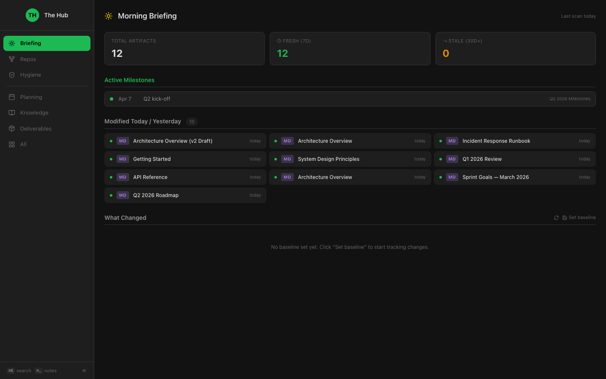
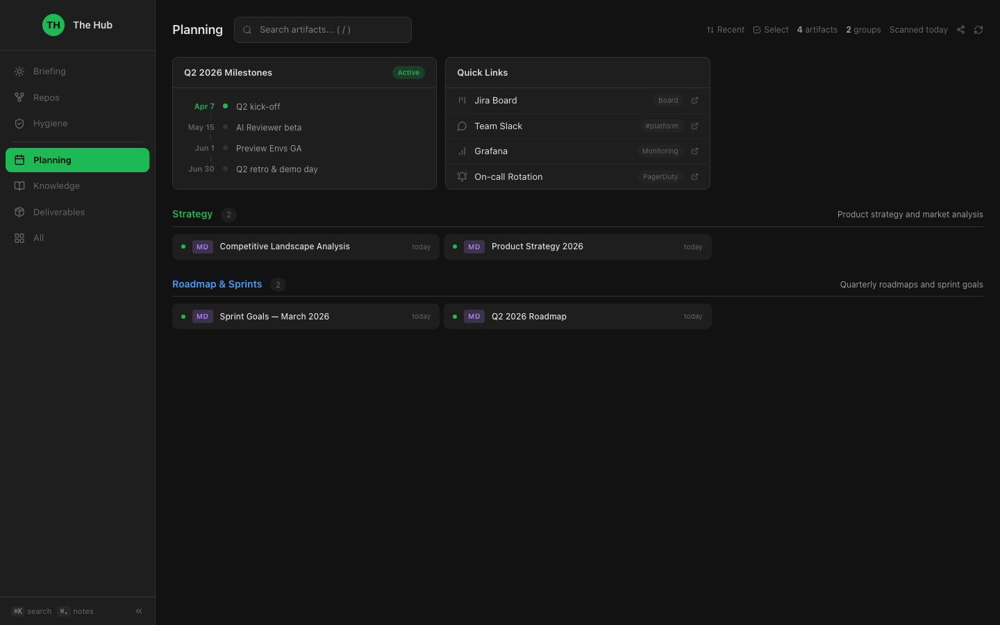
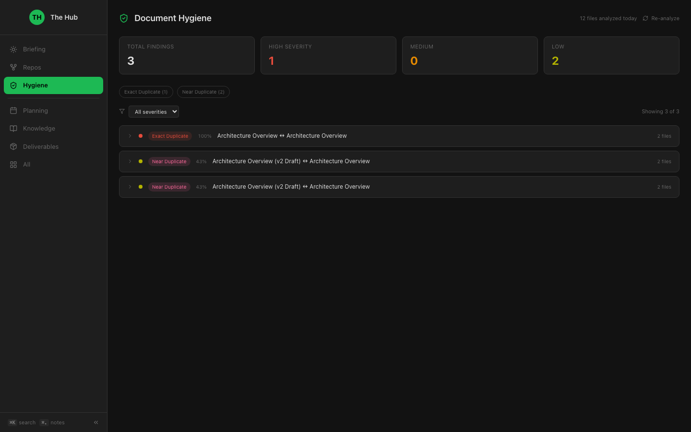
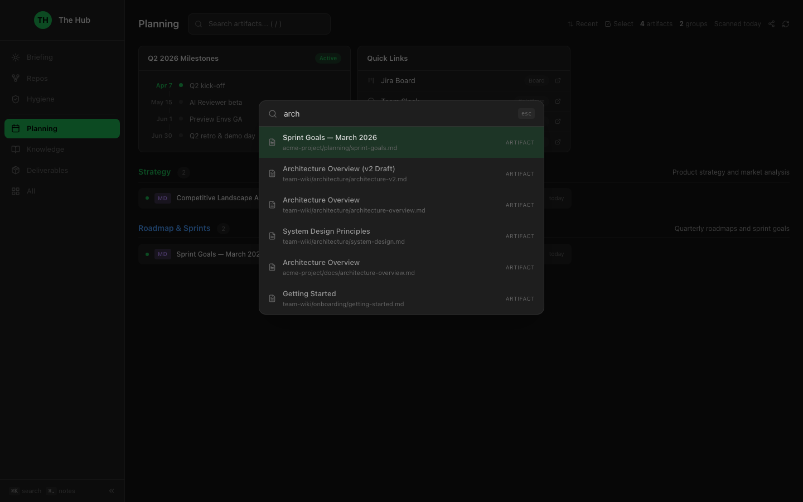
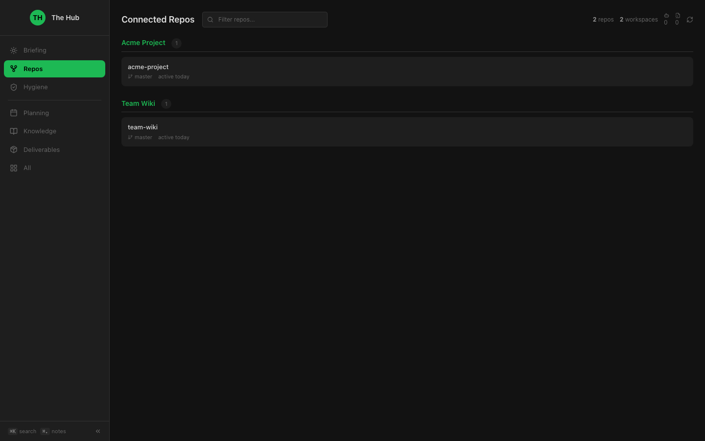
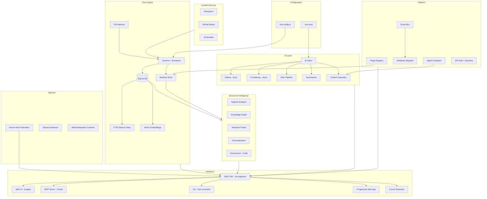

# The Hub

A personal command center that gives you one place to find, preview, and navigate your workspace — from your browser, terminal, or any AI tool.

Point it at your directories. It scans your files, groups them by pattern, and surfaces everything in a searchable, AI-augmented interface with curated panels, knowledge graphs, and document intelligence. No personal information in this repo — your config makes it yours.

## Screenshots

### Morning Briefing


### Planning Tab — Curated Panels + Grouped Artifacts


### Document Hygiene — Detect Duplicates & Redundancies


### Universal Search (Cmd+K)


### Connected Repos


---

## Why

As a PM (or anyone juggling many repos, docs, and tools), context is scattered:
- Strategy docs in one repo, code in another, dashboards elsewhere
- Bookmarks rot, browser tabs multiply, files go stale without anyone noticing
- Duplicate docs accumulate, nobody knows which version is current
- Switching between tools costs attention

The Hub solves this by giving you a **single starting point** — always running, always current — that indexes your workspace and sends you to the right place with context.

## Architecture



## What It Does

### Core

- **Scans directories** you configure and builds a searchable catalog of artifacts (30+ file types: md, html, pdf, docx, json, yaml, code files, and more)
- **Full-text search** powered by SQLite FTS5 — finds content deep inside documents, not just titles
- **Semantic search** with embeddings — understands meaning, not just keywords
- **Groups files by pattern** into tabs — Planning, Knowledge, Deliverables, or whatever structure fits your work
- **10 panel types** — timeline, links, tools, chart (sparklines), checklist, custom (markdown/iframe), health, url, markdown, embed
- **Live file watching** — changes in your workspace auto-update within 5 seconds
- **Config hot-reload** — edit `hub.config.ts`, manifest regenerates without restart
- **Always on** — runs as a macOS LaunchAgent, survives reboots, auto-restarts

### AI Intelligence

- **RAG Q&A** — ask natural language questions about your workspace, get answers with source citations (`/ask` page)
- **AI summarization** — 2-sentence summaries for long documents, group summaries
- **Content generation** — status updates from change feed, handoff docs from groups, PRD outlines from research
- **AI-powered hygiene review** — sends duplicate file pairs to AI for merge/delete recommendations
- **Ollama auto-detection** — zero-config AI when running locally, no API key needed
- **Configurable providers** — OpenAI, Anthropic, Ollama, or any OpenAI-compatible endpoint

### Document Intelligence

- **Document hygiene** — 5 detection engines: exact duplicates (SHA-256), near-duplicates (shingling + Jaccard), similar titles, same filenames, superseded files
- **Knowledge graph** — explicit and wiki-link relationships between artifacts, backlinks, force-directed graph visualization (`/graph` page)
- **Temporal trends** — daily snapshots, trend sparklines, predictive staleness alerts
- **Personalization** — activity tracking, frequently-accessed ranking boosts, search gap detection
- **Content diffs** — inline line-level diffs in the change feed showing what actually changed

### Platform

- **Plugin system** — `HubPlugin` interface with lifecycle hooks (onScan, onSearch, onRender, onInit, onDestroy)
- **GitHub plugin** — PR counts, issue tracking, activity panels from GitHub repos
- **Plugin marketplace** — browse, install, uninstall plugins via CLI or API
- **Agentic workflows** — scheduled tasks: stale-doc reminders, weekly summaries, duplicate resolution
- **Webhook/event system** — 6 event types with HMAC-signed delivery to external endpoints
- **API authentication** — optional API key auth with session tokens for web UI

### Network

- **Hub-to-Hub federation** — federated search across linked Hub instances with source attribution
- **Shared instances** — role-based access (admin, read-write, read-only) with per-user activity tracking
- **Multi-workspace contexts** — switch between "Work" / "Side Projects" / "Learning" configurations
- **Progressive Web App** — installable on mobile, offline-capable with service worker
- **Docker deployment** — Dockerfile + docker-compose for containerized hosting

### Interfaces

| Interface | Description |
|---|---|
| **Web UI** | 8 pages: briefing, tabs, repos, hygiene, ask, graph, admin, marketplace |
| **MCP Server** | 9 tools: search, read, ask, generate, hygiene, trends, repos, groups, manifest |
| **CLI** | `hub search`, `hub status`, `hub open`, `hub plugin install`, `hub context compile` |
| **REST API** | 34 endpoints covering every feature |
| **PWA** | Installable on mobile home screens, offline-capable |
| **Cursor Extension** | Hub as an editor tab (Cmd+Shift+H) |

## Install

### One-Line Setup

```bash
git clone https://github.com/ahmedkhaledmohamed/the-hub.git && cd the-hub && bash setup.sh
```

### Docker

```bash
docker compose up -d
open http://localhost:9002
```

### Manual Setup

```bash
git clone https://github.com/ahmedkhaledmohamed/the-hub.git
cd the-hub && npm install
cp hub.config.example.ts hub.config.ts  # Edit with your workspace paths
npm run build && npm start
```

### MCP Server (for Claude Code / Cursor)

```json
{
  "mcpServers": {
    "the-hub": {
      "command": "node",
      "args": ["/path/to/the-hub/bin/hub-mcp.js"]
    }
  }
}
```

## Configuration

Everything lives in `hub.config.ts` (gitignored). See `hub.config.example.ts` for a full example.

```typescript
const config: HubConfig = {
  name: "My Hub",
  workspaces: [{ path: "~/Developer/my-project", label: "My Project" }],
  groups: [{ id: "docs", label: "Docs", match: "my-project/docs/**", tab: "knowledge", color: "#3b82f6" }],
  tabs: [{ id: "knowledge", label: "Knowledge", icon: "book-open", default: true }],
  panels: { knowledge: [{ type: "links", title: "Quick Links", items: [...] }] },

  // Optional: AI (auto-detects Ollama, or set AI_GATEWAY_URL in .env.local)
  // Optional: agents, webhooks, sharing, federation, governance, contexts
};
```

## API (34 endpoints)

| Category | Endpoints |
|---|---|
| **Core** | `/api/manifest`, `/api/regenerate`, `/api/file/[...path]`, `/api/resolve`, `/api/search`, `/api/repos`, `/api/changes`, `/api/export`, `/api/compile-context`, `/api/notes`, `/api/new-doc`, `/api/proxy` |
| **AI** | `/api/ai/complete`, `/api/ai/ask`, `/api/ai/generate`, `/api/ai/summarize` |
| **Hygiene** | `/api/hygiene`, `/api/hygiene/action`, `/api/hygiene/review`, `/api/hygiene/open` |
| **Intelligence** | `/api/graph`, `/api/trends`, `/api/activity`, `/api/admin` |
| **Platform** | `/api/plugins`, `/api/marketplace`, `/api/agents`, `/api/webhooks`, `/api/webhooks/test`, `/api/auth/session`, `/api/framework` |
| **Network** | `/api/federation`, `/api/sharing`, `/api/contexts` |

## Tech Stack

- **Next.js 15** with App Router and Turbopack
- **React 19** with server components
- **SQLite** (better-sqlite3) with FTS5 full-text search
- **Tailwind CSS v4** + shadcn/ui primitives
- **MCP SDK** for AI tool integration
- **marked** + **highlight.js** for markdown rendering
- **chokidar** for filesystem watching
- **vitest** for testing (321 tests)

## Commands

```bash
npm run dev        # Dev server with Turbopack
npm run build      # Production build
npm start          # Production server (HTTPS :9001 + HTTP :9002)
npm test           # Run all 321 tests
npm run mcp        # Start MCP server
hub search <query> # CLI search
hub status         # Workspace status
hub plugin list    # Browse marketplace
bash setup.sh      # Interactive setup
```

## Project Structure

```
the-hub/
├── hub.config.example.ts     # Config template
├── server.mjs                # Dual-port server
├── Dockerfile                # Container deployment
├── docker-compose.yml        # Docker Compose
├── bin/
│   ├── hub.js                # CLI tool
│   └── hub-mcp.js            # MCP server entry
├── plugins/
│   ├── hello-world/          # Example plugin
│   └── github/               # GitHub integration
├── public/
│   ├── manifest.json         # PWA manifest
│   └── sw.js                 # Service worker
├── src/
│   ├── app/                  # Next.js pages + 34 API routes
│   ├── components/           # React components
│   ├── mcp/                  # MCP server (9 tools)
│   ├── lib/                  # 30 library modules
│   └── middleware.ts         # API authentication
└── tests/                    # 321 tests across 11 suites
```

## Links

- [Landing Page](https://ahmedkhaledmohamed.github.io/the-hub/)
- [Future Developments](docs/future-developments.md)
- [Execution Steps](docs/execution-steps.md)
- [Release v1.0.0](https://github.com/ahmedkhaledmohamed/the-hub/releases/tag/v1.0.0)
