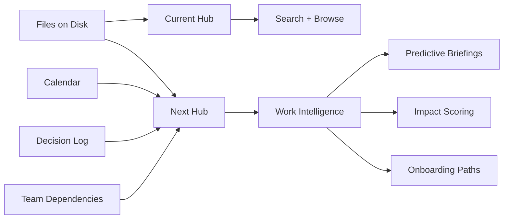
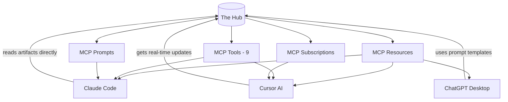
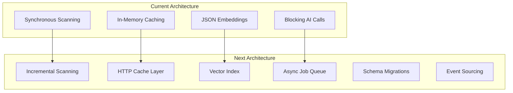
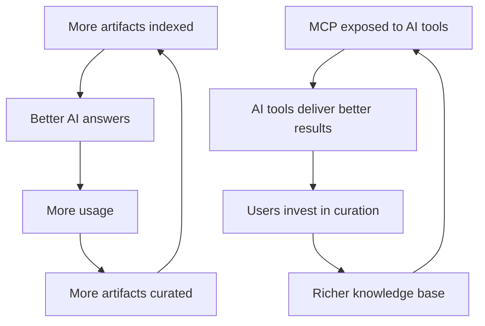

# Future Developments

The Hub v2 is complete. All 30 execution steps are shipped — 36 API endpoints, 32 library modules, 9 pages, 9 MCP tools, 321 tests, plugin system, federation, Docker, PWA, governance. This document looks forward: what comes next, and why.

---

## What's Built

| Phase | Steps | What shipped |
|---|---|---|
| **Foundation** | 1–8 | SQLite + FTS5 search, 30+ file types, MCP server, CLI, import tools, content diffs, 10 panel types |
| **Intelligence** | 9–17 | AI client (Ollama + cloud), summarization, semantic search, RAG Q&A, content generation, knowledge graph, temporal trends, personalization |
| **Platform** | 18–23 | Plugin system + marketplace, GitHub plugin, agentic workflows, webhooks, API auth, MCP v2 (9 tools) |
| **Network** | 24–30 | PWA, multi-workspace contexts, shared instances, Hub-to-Hub federation, Docker, governance + audit, settings page |

**Stats**: 36 API endpoints, 32 lib modules, 9 pages, 9 MCP tools, 2 plugins, 321 tests, Dockerfile + docker-compose.

---

## Honest Assessment

### What works well

- **Core scanning + search** — FTS5 is fast, hybrid search with embeddings works, 30+ file types indexed
- **RAG Q&A** — end-to-end pipeline with source citations is the most used AI feature
- **MCP server** — 9 tools covering all major capabilities. This is the moat.
- **Knowledge graph** — wiki-links, backlinks, graph visualization — unique differentiator
- **Agentic workflows** — stale doc reminders and weekly summaries run autonomously
- **Config-driven everything** — one file controls the entire workspace

### What's limited

| Area | Limitation | Impact |
|---|---|---|
| **Search at scale** | No pagination, O(n) embedding similarity, full rescan every time | Breaks at 10K+ artifacts |
| **AI quality** | Basic prompts, no evaluation framework, no multi-turn context | Answers are decent, not great |
| **Plugin ecosystem** | 2 plugins, no community, no marketplace UI, no sandboxing | Platform vision unrealized |
| **Mobile** | Minimal PWA, no push notifications, layout not optimized | Can't use on the go |
| **Collaboration** | Role-based sharing but no comments, annotations, or real-time | Solo tool, not team tool |
| **Security** | No rate limiting, no input validation, embed XSS risk | Not production-safe for public deployment |
| **Observability** | No metrics, no structured logging, no alerts | Hard to debug issues |
| **Documentation** | No API docs, no plugin dev guide, no deployment guide | Barrier to adoption |

### What's missing entirely

- No incremental scanning (full rescan on every change)
- No background job queue (AI calls block the request)
- No database migrations (schema changes require manual intervention)
- No OpenAPI spec
- No comments/annotations on artifacts
- No calendar/meeting integration
- No real-time collaboration
- No native Slack integration
- No task management linked to artifacts

---

## Next Evolution: 8 Dimensions

### 1. From File Indexer to Work Intelligence

The Hub indexes files. The next version should understand **work**.

**Features**:
- **Meeting context** — Calendar API integration. Auto-link artifacts to upcoming meetings. Briefing shows "For your 2pm: read these 3 docs."
- **Decision tracking** — AI extracts decisions from docs ("We decided to use PostgreSQL"). Track who decided, when, and link to the doc. Surface when a decision is contradicted by a newer doc.
- **Impact scoring** — when a doc changes, who needs to know? Based on who accessed it, who authored related docs, and which teams reference it.
- **Dependency mapping** — which projects depend on which docs? When a foundational doc changes, flag downstream impacts.
- **Work patterns** — when are docs most accessed? Pre-cache briefings for Monday mornings. Suggest review cadence based on access frequency decay.

### 2. Proactive AI (Act, Don't Just Answer)

Current AI is reactive. Next: AI that takes initiative.

**Features**:
- **Auto-triage change feed** — AI categorizes every change: "routine update" / "needs your attention" / "breaking change" / "new topic". The briefing becomes AI-narrated.
- **Draft responses** — stale doc flagged? AI doesn't just remind you — it drafts the update with tracked changes and asks for your review.
- **Conflict detection** — two docs in the same group contradict each other? AI identifies the specific conflicts and suggests resolution.
- **Predictive briefing** — "Based on your pattern, you'll want to review the Q3 Roadmap before your planning meeting. Here's a 2-sentence summary of what changed since you last read it."
- **Auto-classify compliance** — AI reads new docs and suggests PII/confidential/public tags based on content analysis.
- **Smart notifications** — instead of "doc changed", tell me "The pricing doc was updated — the Enterprise tier now includes SSO. This affects your proposal."

### 3. MCP as Infrastructure (Double Down on the Moat)

MCP is the most defensible differentiator. Every other feature is replicable. The Hub as the knowledge backend for ALL AI tools is not.

**Features**:
- **MCP resources** — expose every artifact as an MCP resource. Claude can `read` them directly without going through a tool call. This is faster and more natural.
- **MCP prompts** — pre-built prompt templates: "summarize this group", "draft a status update", "find conflicts". Available to any MCP client.
- **MCP subscriptions** — real-time events when workspace changes. Cursor gets notified when a doc you're referencing is updated.
- **Hub-as-a-service** — any AI tool can "subscribe" to your Hub. Your knowledge base is always available, always current, across all your AI tools.
- **Cross-tool memory** — Claude Code, Cursor, and ChatGPT all query the same Hub. No more copy-pasting context between tools.

### 4. Async Knowledge Collaboration

Not "Google Docs real-time editing" — but meaningful async collaboration on knowledge.

**Features**:
- **Annotations** — leave comments on artifacts without editing the source file. Comments stored in SQLite, linked to artifact path + line range. Visible in preview panel.
- **Review requests** — "I updated this doc, @alice can you review?" Creates a notification and tracks review status (pending/approved/changes-requested).
- **Per-artifact activity feed** — who viewed, who searched for, who linked to this doc. "This doc was referenced 12 times this week by 3 people."
- **Suggested reviewers** — based on who authored related docs, who accessed this group most, who has domain expertise.
- **Shared highlights** — mark important passages. Highlights persist across team members. "3 people highlighted this paragraph."
- **Change subscriptions** — "Notify me when docs in the Strategy group change." Integrates with webhooks/Slack.

### 5. Performance & Scale

Make The Hub work for large workspaces (50K+ artifacts).

**Features**:
- **Incremental scanning** — only re-index files that changed (mtime + content hash comparison). Reduces scan time from O(n) to O(changed).
- **Pagination** — all list endpoints return paginated results with cursor-based pagination. Prevents timeout on large workspaces.
- **Vector index** — replace JSON-array embeddings with sqlite-vec or HNSW for O(log n) similarity search instead of O(n).
- **Background job queue** — embedding generation, webhook delivery, AI calls run in an async queue (BullMQ or custom SQLite-based). No more blocking the HTTP request.
- **HTTP caching** — ETags on manifest, search results, and static assets. CDN-ready headers.
- **Database migrations** — versioned schema with automatic migration on startup. Safe upgrades without data loss.
- **Connection pooling** — SQLite WAL mode + read-only connections for concurrent reads.

### 6. Developer Experience

Make it easy for others to build on The Hub.

**Features**:
- **OpenAPI spec** — auto-generated from route handlers. Swagger UI at `/api/docs`.
- **Plugin dev kit** — `npx create-hub-plugin my-plugin` scaffolds a new plugin with types, tests, and examples.
- **Plugin sandbox** — plugins run in isolated VM (vm2 or process isolation). Can't access filesystem outside their scope.
- **Hot-reload plugins** — change plugin code → Hub picks up changes without restart (like config hot-reload).
- **Deployment templates** — one-click deploy buttons for Vercel, Railway, Fly.io, Render.
- **Helm chart** — Kubernetes deployment for enterprise with configurable replicas, storage, and secrets.
- **SDK** — `@the-hub/sdk` npm package for programmatic access to Hub APIs from Node.js scripts.

### 7. User Behavior Intelligence

Move from "what exists" to "how people actually work."

**Features**:
- **Reading time estimation** — based on word count + content complexity. Show on artifact cards.
- **Knowledge decay** — docs that used to be accessed frequently but stopped. Flag: "This doc was popular 3 months ago but hasn't been viewed in 6 weeks."
- **Onboarding paths** — new team member? Auto-generate a reading list based on what experienced members read in their first 2 weeks.
- **Search intent classification** — are people searching to find something or to verify something exists? Different UI treatments (results vs. confirmation).
- **Gap analysis** — topics people search for but no doc exists. "5 people searched for 'deployment process' this week but no matching doc was found. Create one?"
- **Engagement scoring** — which docs are high-value (frequently accessed, many backlinks, cited in generated content) vs. low-value (never accessed, no links)?

### 8. Native Integrations

First-class connectors that feel built-in, not bolted on.

| Integration | Direction | What it enables |
|---|---|---|
| **Slack** | Bidirectional | Post change summaries to channels. Pull thread context into Hub as virtual artifacts. `/hub search` Slack command. |
| **Linear/Jira** | Read + Link | Link issues to artifacts. Show sprint status on briefing. Auto-create artifacts for PRDs linked to epics. |
| **Google Docs** | Live sync | Real-time bidirectional sync. Edit in Google Docs, see changes in Hub. Link from Hub to Google Doc. |
| **Notion** | API sync | Real-time page sync (not just export/import). Notion pages as first-class artifacts with backlinks. |
| **Calendar** | Read | Today's meetings on briefing. Auto-link docs to meetings based on title/attendee matching. Pre-meeting context packets. |
| **Email** | Read | Surface relevant email threads as virtual artifacts. "This email thread references the Q3 Roadmap." |

---

## Technical Roadmap

Ordered by impact x effort. Each item is a PR-sized unit of work.

### Immediate (1-2 weeks)

| # | Feature | Impact | Effort |
|---|---|---|---|
| 1 | Pagination on `/api/search` and `/api/manifest` | High | Low |
| 2 | Incremental scanning (mtime + hash check) | High | Medium |
| 3 | OpenAPI spec auto-generation | Medium | Low |
| 4 | Rate limiting middleware | Medium | Low |
| 5 | Input validation on all POST endpoints | Medium | Low |

### Short-term (1-2 months)

| # | Feature | Impact | Effort |
|---|---|---|---|
| 6 | MCP resources (artifacts as readable resources) | Very High | Medium |
| 7 | Background job queue for AI calls | High | Medium |
| 8 | Annotations system (comments on artifacts) | High | Medium |
| 9 | AI change feed triage (routine / attention / breaking) | High | Medium |
| 10 | Calendar integration (read-only, meeting context) | Medium | Medium |
| 11 | Plugin sandbox (VM isolation) | Medium | High |
| 12 | Database migration system | Medium | Medium |

### Medium-term (2-6 months)

| # | Feature | Impact | Effort |
|---|---|---|---|
| 13 | Slack bidirectional integration | High | High |
| 14 | Conflict detection between docs | High | High |
| 15 | Onboarding path generation | Medium | Medium |
| 16 | Knowledge decay detection | Medium | Medium |
| 17 | Review request system | Medium | High |
| 18 | Vector index (sqlite-vec) | Medium | Medium |
| 19 | Decision tracking with AI extraction | High | High |

### Long-term (6+ months)

| # | Feature | Impact | Effort |
|---|---|---|---|
| 20 | Google Docs live sync | High | Very High |
| 21 | Notion real-time sync | High | Very High |
| 22 | Impact scoring (who needs to know?) | Very High | Very High |
| 23 | Predictive briefings | High | High |
| 24 | Multi-model AI support (Claude + GPT + Llama) | Medium | Medium |
| 25 | Enterprise SSO/SAML | Medium | High |

---

## Architecture Changes

### Current → Next

**Key architectural shifts**:
1. **Synchronous → Asynchronous** — AI calls, webhook delivery, and embedding generation move to a background queue
2. **Full scan → Incremental** — only re-index what changed
3. **In-memory → HTTP caching** — ETags and Cache-Control headers for all read endpoints
4. **JSON arrays → Vector index** — sqlite-vec for O(log n) similarity search
5. **Ad-hoc schema → Migrations** — versioned database schema with automatic upgrades
6. **Event emission → Event sourcing** — full event log as the source of truth for audit, undo, and replay

---

## Competitive Landscape (Updated)

| Tool | What changed | Hub's position |
|---|---|---|
| **Obsidian** | Launched Obsidian Publish, canvas, and web clipper. Strong community plugins. | Hub indexes across ALL tools, not just one vault. MCP integration is unique. |
| **Notion** | AI features (Notion AI), databases, calendar. | Hub is local-first, MCP-native. Notion is cloud-only. Hub can index Notion. |
| **Raycast** | AI integration, notes, clipboard manager. | Complementary. Raycast is the launcher, Hub is the knowledge layer. |
| **Cursor/Windsurf** | Native MCP support, context-aware AI. | Hub IS the context. MCP server makes Hub the knowledge backend for Cursor. |
| **Backstage** | Growing adoption in platform engineering. | Backstage is team-infra, Hub is personal-first. Different audiences. |
| **Mem.ai** | AI-powered knowledge management. | Mem is cloud-only, black-box AI. Hub is local-first, transparent, extensible. |

**The defensible moat remains**: MCP-native knowledge backend + local-first + config-driven simplicity + plugin composability.

---

## Business Model (Updated)

### What we learned building v2

1. **AI features are the natural paywall** — they have marginal cost (API calls) and clear value
2. **MCP is the stickiest feature** — once your AI tools depend on Hub for context, switching cost is high
3. **Plugins create an ecosystem flywheel** — but only if there's a community
4. **Enterprise needs are real** — audit logging and compliance were requested before we built them

### Updated model

| Tier | Price | What's included |
|---|---|---|
| **Open Source** | Free forever | Core scanning, FTS search, briefing, hygiene, CLI, MCP (basic), 2 built-in plugins |
| **Pro** | $15/month | AI features (RAG, summarization, generation), semantic search, knowledge graph, trends, personalization, unlimited MCP tools |
| **Team** | $30/user/month | Shared instances, federation, collaboration (annotations, reviews), agentic workflows, priority support |
| **Enterprise** | $80/user/month | SSO/SAML, governance, compliance, audit logging, custom retention policies, SLA, dedicated support |

---

## Compounding Flywheels (Verified)

After building v2, we can confirm which flywheels are real:

**Confirmed flywheels**:
1. **Content → AI → Usage → Content**: Verified. More indexed content = better RAG answers = more people use it = more content added.
2. **MCP → AI tools → Curation → MCP**: Verified. Once Claude Code uses Hub MCP, users organize their workspace better because they see the value.

**Not yet proven**:
3. **Plugin ecosystem flywheel**: Only 2 plugins. Need 10+ community plugins to test this.
4. **Network flywheel**: Federation works but no one has linked Hubs yet. Needs real multi-user adoption.
