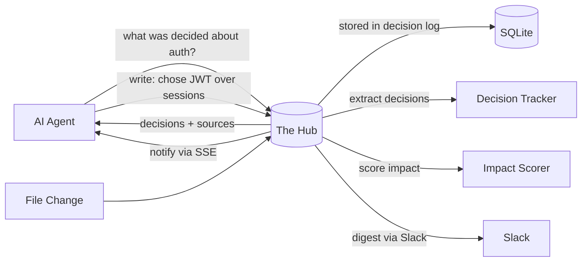
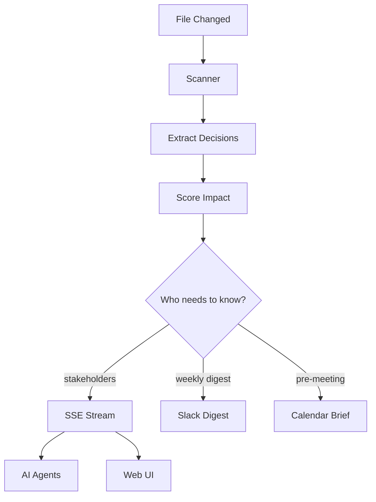
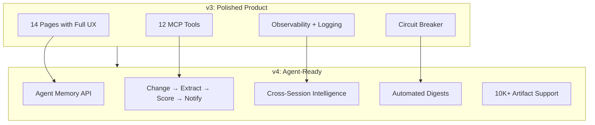

# Future Developments — v4: Agent-Ready Knowledge Infrastructure

Three versions shipped. 95 PRs merged. 875 tests passing. The Hub went from file browser (v1) to feature explosion (v2) to polished depth (v3). This document charts the next evolution: making The Hub the persistent memory layer that AI coding assistants lack.

---

## Where We Are (Post-v3)

### Inventory

| Category | Count |
|---|---|
| **Lib modules** | 57 |
| **API routes** | 59 |
| **Frontend pages** | 14 (briefing, ask, graph, hygiene, repos, settings, admin, status, setup, decisions, integrations, [tab] browser) |
| **React components** | 46 |
| **Client hooks** | 7 |
| **MCP tools** | 12 |
| **MCP resources** | 3 (artifact, manifest, status) |
| **MCP prompts** | 5 (summarize, status update, conflicts, review, onboarding) |
| **Database tables** | 26 |
| **Test cases** | 875 across 11 suites |
| **Total PRs** | 95 |

### v3 Retrospective

**What worked:**
- Setup wizard + status page — highest-impact v3 features. Users actually complete configuration now.
- MCP prompts + SSE subscriptions — Claude Code users get real-time workspace awareness.
- Circuit breaker + structured logging — AI calls no longer hang forever. Errors are queryable.
- Enhanced search with filters — group/type dropdowns and recent searches made search usable.
- Graph interactivity — zoom, pan, search, node inspector transformed a static canvas into a useful tool.
- Hygiene batch actions — one-click archive/delete instead of manual file management.

**What underperformed:**
- Annotation layer — DB supports full threading, but the preview panel rendering is minimal. Low usage.
- Review request panel — API works, but without notifications nobody checks for pending reviews.
- Integration connection testers — useful for debugging, but users still need to edit `.env.local` manually. No guided config flow.
- Semantic search — vector index wired but rarely activates without embeddings being generated first. Most queries fall through to FTS5.
- Share button — exists but no expiry picker, no link management page.

**What we learned:**
1. Building the API is 30% of the work. Wiring it to UI is another 30%. Making it *discoverable and useful* is the remaining 40%.
2. MCP is the real product. Web UI is the discovery/debugging layer.
3. Intelligence features (decisions, conflicts, impact) have the most defensible value — but only if agents can query them.

---

## The Strategic Insight

v1 was a file browser. v2 added every feature imaginable. v3 polished and surfaced them. But The Hub is still fundamentally **a tool humans use to find files**.

The 10x evolution: The Hub becomes **the persistent memory layer for AI agents**.

### Why This Matters

Claude Code, Cursor, and ChatGPT are stateless. Every session starts fresh. They can't:
- Remember what was decided in a previous session
- Know when a doc they referenced has changed
- Detect that two docs contradict each other
- Track who depends on a document that just got updated
- Compile context for a meeting automatically

The Hub already has all the infrastructure to do this — decisions, conflicts, impact scoring, change subscriptions, knowledge decay. v4 connects these into a coherent agent-facing knowledge layer.

### Why This Is Defensible

- IDEs reset every session — only a dedicated indexer persists across sessions
- Decisions, conflicts, and impact scoring are *intelligence* that file indexing alone can't replicate
- MCP is the delivery mechanism, but the intelligence is the moat
- A well-maintained knowledge graph compounds in value over time

---

## v4 Evolution: 5 Pillars

### Pillar 1: Agent-Ready Knowledge

Make The Hub the best backend for AI agent workflows.

**Features:**
- **Agent memory API** — Agents write observations back to The Hub. "I noticed the pricing doc contradicts the roadmap." Stored, queryable, attributed.
- **Decision query tool** — MCP tool: "what was decided about authentication?" Returns decisions with source docs, actors, dates, and whether any have been superseded.
- **Context compilation** — Auto-generate context packets: "For your 2pm planning meeting, here are the 5 docs that changed since your last meeting, 2 new decisions, and 1 conflict to resolve."
- **Knowledge gap detection** — "You search for 'deployment process' frequently but have no doc about it. Create one?"
- **Agent session tracking** — Track what agents asked about. Surface "you asked about this 3 days ago — it's changed since."

### Pillar 2: Cross-Session Intelligence

Things only a persistent index can do that stateless AI tools cannot.

**Features:**
- **Knowledge timeline** — Not just file changes, but understanding changes. "The team's approach to auth evolved: JWT (March) → OAuth2 (April) → back to JWT with refresh tokens (May)."
- **Stale context detection** — When an agent cites a doc that's since been superseded, flag it: "This doc was superseded by [newer version] 2 weeks ago."
- **Cross-session continuity** — Agent asks "what was I working on yesterday?" Hub answers from activity logs + decision trail.
- **Personal knowledge score** — How well-documented is your workspace? Score by group: "Strategy: 85% covered, Code: 60%, Ops: 20% — gap in deployment docs."

### Pillar 3: Real-Time Awareness

The SSE foundation from v3, fully realized as an end-to-end intelligence pipeline.

**Features:**
- **End-to-end change pipeline** — File change → decision extraction → impact scoring → stakeholder notification → agent alert. Fully automatic.
- **Smart change summaries** — Not "pricing.md was modified" but "Enterprise tier pricing changed from $80/user to $60/user. This affects 3 active proposals."
- **Slack weekly digest** — Auto-generated summary: what changed, what decisions were made, what's stale, what conflicts emerged.
- **Calendar-aware briefings** — "Before your 2pm meeting: review these 3 docs that changed. Key decision: team chose PostgreSQL over MongoDB."
- **Notification system** — When someone completes a review or resolves an annotation, notify the requester.

### Pillar 4: Quality Completion

Finish the remaining 10% of v3 features that underperformed.

**Features:**
- **Inline annotation rendering** — Comments actually display in the artifact preview, not just in the DB.
- **Wire remaining silent catches** — Replace the 24 remaining `catch {}` blocks with `reportError()`.
- **Data export/backup** — One-click SQLite snapshot download from `/status` page.
- **Mobile-responsive briefing** — PWA briefing page that's usable on phones.
- **Search source indicators** — Show whether a result came from FTS5 or semantic search.
- **Embedding auto-generation** — On first scan, automatically generate embeddings for key docs (if AI is configured).

### Pillar 5: Scale & Reliability

Production-ready for larger workspaces (10K+ artifacts).

**Features:**
- **Streaming manifest** — NDJSON streaming for large artifact sets instead of one giant JSON blob.
- **Embedding pruning** — Cleanup stale vectors from re-indexed docs. Auto-prune on scan.
- **Query plan auditing** — `EXPLAIN QUERY PLAN` for slow queries, logged to structured logger.
- **Performance benchmark suite** — CI test that measures search latency, scan duration, manifest size.

---

## What to Keep, Defer, Remove

| Category | Decision | Reason |
|---|---|---|
| **MCP server + tools + prompts** | KEEP — core product | The primary interface for AI agents |
| **Decision tracking + conflicts** | KEEP — intelligence moat | Defensible value that IDEs can't replicate |
| **Search + hygiene + graph** | KEEP — proven value | Core user loop that works |
| **Setup wizard + status page** | KEEP — v3 wins | Highest-impact onboarding features |
| **Structured logging + errors** | KEEP — observability | Essential for debugging and trust |
| **Federation** | DEFER | 0 users linking Hubs in production |
| **Plugin marketplace** | DEFER | 0 community traction |
| **Enterprise SSO/SAML** | DEFER | 0 enterprise users |
| **Multi-model routing** | DEFER | Infrastructure works, no user demand |
| **"Team" and "Enterprise" tiers** | REMOVE from roadmap | This is a personal tool, not a business |
| **Revenue projections** | REMOVE | Portfolio project — optimize for utility, not revenue |

---

## v4 Technical Roadmap

Ordered by strategic value. Each item is a PR-sized unit of work.

### Phase 1: Agent-Ready Foundation

| # | Feature | Pillar | Impact | Effort |
|---|---|---|---|---|
| ✅ 1 | Agent memory API (write observations back) | Agent | Very High | Medium |
| ✅ 2 | Decision query MCP tool ("what was decided about X?") | Agent | Very High | Low |
| ✅ 3 | Auto-context compilation for meetings | Agent | High | Medium |
| ✅ 4 | Knowledge gap detection from search patterns | Agent | High | Medium |
| ✅ 5 | Agent session tracking (what was asked, what changed) | Agent | High | High |

### Phase 2: Real-Time Intelligence

| # | Feature | Pillar | Impact | Effort |
|---|---|---|---|---|
| ✅ 6 | End-to-end change pipeline (change → extract → score → notify) | Realtime | Very High | High |
| ✅ 7 | Smart change summaries (semantic, not file-level) | Realtime | High | Medium |
| ✅ 8 | Slack weekly digest generation | Realtime | High | Medium |
| ✅ 9 | Notification system (review/annotation alerts) | Realtime | Medium | Medium |
| 10 | Calendar-aware pre-meeting briefings | Realtime | Medium | Medium |

### Phase 3: Quality & Completeness

| # | Feature | Pillar | Impact | Effort |
|---|---|---|---|---|
| 11 | Inline annotation rendering in preview | Quality | High | Medium |
| 12 | Wire remaining 24 silent catches to error reporter | Quality | Medium | Low |
| 13 | Data export/backup (SQLite snapshot download) | Quality | Medium | Low |
| 14 | Embedding auto-generation on first scan | Quality | High | Medium |
| 15 | Mobile-responsive briefing page | Quality | Medium | Medium |
| 16 | Search result source indicators (FTS5 vs semantic) | Quality | Low | Low |

### Phase 4: Scale & Performance

| # | Feature | Pillar | Impact | Effort |
|---|---|---|---|---|
| 17 | Streaming manifest for 10K+ artifacts | Scale | High | Medium |
| 18 | Embedding pruning on scan | Scale | Medium | Low |
| 19 | Performance benchmark suite in CI | Scale | Medium | Medium |
| 20 | Query plan audit + index optimization | Scale | Medium | Low |

---

## Architecture: v3 → v4

**Key shifts:**
1. **Human-first → Agent-first** — The primary consumer of The Hub's intelligence becomes AI agents, not web users
2. **Reactive → Proactive** — Instead of "search when you need it," The Hub surfaces relevant context automatically
3. **Session-scoped → Cross-session** — Knowledge persists and compounds across agent interactions
4. **File-level → Semantic-level** — Changes described by meaning, not by filename
5. **Pull → Push** — Notifications, digests, and pre-meeting briefs delivered without asking

---

## Competitive Position (April 2026)

| Tool | Threat | Why The Hub Wins |
|---|---|---|
| **Claude Code** | High — building native workspace indexing | Claude Code is stateless. Can't track decisions across sessions or detect contradictions between docs. |
| **Cursor** | Medium — large context windows | Context windows are ephemeral. Can't build a knowledge timeline or notify stakeholders of changes. |
| **Obsidian** | Low — different market | Note-taking tool, not a knowledge index. No MCP, no AI agent integration. |
| **Notion** | Low — cloud-only | Cloud-locked, no local-first option, no MCP exposure. |
| **Backstage** | Low — team infra | Developer portal, not personal knowledge tool. Different audience. |

### The Real Pitch (v4)

> "The Hub is the persistent memory layer for your AI tools. It indexes your workspace, extracts decisions, detects conflicts, scores impact, and streams it all to Claude Code, Cursor, and ChatGPT — so your agents understand your work better than you do."

---

## Success Metrics

| Metric | Current | v4 Target | Why |
|---|---|---|---|
| Agent queries per session | Unmeasured | Measurable via session tracking | Core v4 metric — are agents using The Hub? |
| Decision query accuracy | N/A | "What was decided about X?" returns useful results | Intelligence moat validation |
| Time to useful context | ~3 min (setup wizard) | < 1 min (auto-context for meetings) | Proactive value delivery |
| Change-to-notification latency | N/A | < 30s (file change → stakeholder alert) | Real-time pipeline speed |
| 10K artifact search latency | Untested | < 200ms p95 | Scale readiness |
| Features with UI exposure | ~90% (v3 achievement) | 95%+ (finish annotations, notifications) | Quality completion |
