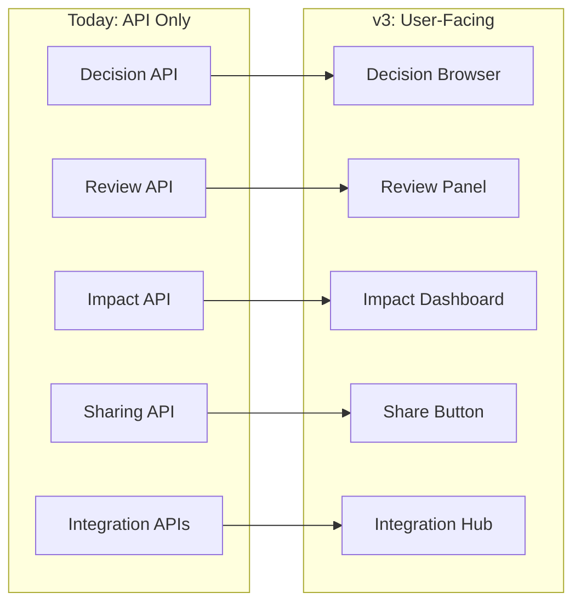
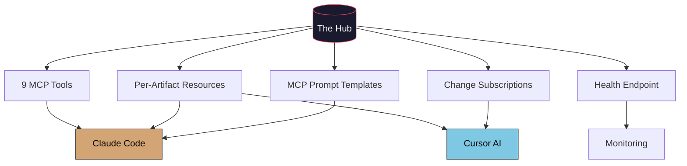
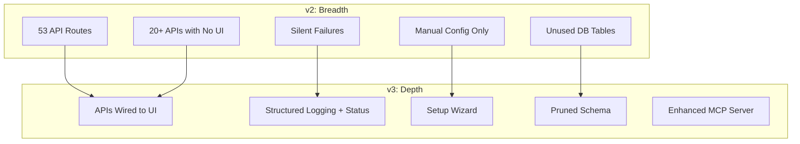

# Future Developments — v3: Depth Over Breadth

The Hub v2 shipped everything on its roadmap. 55 execution steps, 54 lib modules, 53 API routes, 624 tests, 9 MCP tools. Every checkbox is checked. This document is about what that actually means — and what comes next.

---

## What's Built (Accurate Inventory)

| Category | Count | Examples |
|---|---|---|
| **Lib modules** | 54 | scanner, db, ai-client, knowledge-graph, hygiene-analyzer, embeddings, rag, sso, multi-model, impact-scoring |
| **API routes** | 53 | manifest, search, ask, generate, hygiene, graph, decisions, reviews, google-docs, notion, slack, sso, impact |
| **Frontend pages** | 9 | briefing, ask, graph, hygiene, repos, settings, admin, [tab] browser |
| **React components** | 37 | artifact grid, preview, command palette, briefing, framework catalog |
| **MCP tools** | 9 | search, read_artifact, ask_question, generate_content, get_hygiene, get_trends, list_groups, get_manifest, list_repos |
| **MCP resources** | 2 | artifact template (hub://artifact/{path}), manifest (hub://manifest) |
| **Test suites** | 11 | 624 test cases across ai-client, change-feed, cli, db, extractors, import-tools, mcp-server, panel-types, scanner, search-api, summarizer |
| **Database tables** | 15+ | artifacts, search_index (FTS5), artifact_links, artifact_opens, annotations, decisions, review_requests, sso_sessions, and more |

---

## Honest Assessment: The Tier System

Not everything that's "shipped" is actually usable. Here's the reality:

### Tier 1 — Works End-to-End (User-Facing)
Features with backend + UI + tests. A user can discover and use these without reading docs.

| Feature | Quality | Notes |
|---|---|---|
| Workspace scanning + indexing | 9/10 | FTS5, 30+ file types, incremental scan, file watcher |
| Full-text search | 9/10 | Fast, supports phrases, filters by group |
| Artifact browsing (tab pages) | 8/10 | Grid layout, preview panel, launcher actions |
| Morning briefing | 7/10 | Change feed, stale detection, pinned artifacts |
| RAG Q&A (/ask) | 7/10 | Source citations, conversation-style — requires AI config |
| Document hygiene | 8/10 | Duplicates, stale, similar titles, template overlap detection |
| Knowledge graph | 6/10 | Wiki-links, backlinks, force visualization — minimal interactivity |
| Git repo discovery | 8/10 | Finds repos, detects CLAUDE.md and cursor rules |
| Settings / preferences | 6/10 | Skip directories, theme — limited scope |
| MCP server | 9/10 | 9 tools + 2 resources, fully functional for Claude Code/Cursor |
| Command palette (Cmd+K) | 8/10 | Fast artifact search, keyboard navigation |

### Tier 2 — Backend Built, No UI
API endpoints exist and work. Tests pass. But no user can discover or use these from the web interface.

| Feature | Backend | Missing |
|---|---|---|
| Google Docs sync | API: link, pull, sync-all | No UI to initiate linking |
| Notion sync | API: link, pull, sync-all, database query | No UI to initiate linking |
| Slack integration | Webhook posting, slash commands | No UI to configure channels |
| Decision tracking | Heuristic + AI extraction, contradiction detection | No decision browser UI |
| Review requests | CRUD, status transitions, per-artifact queries | No review panel UI |
| Impact scoring | Multi-signal scoring, stakeholder identification | Not surfaced in any page |
| Predictive briefing | Access patterns + calendar + changes | Not integrated into briefing page |
| Annotations | Comments on artifacts with threading | No annotation UI on previews |
| Sharing / public links | Link generation with expiry | No share button on artifacts |
| Plugin marketplace | Plugin registry, install API | No install UI |
| Agent scheduler | Background job scheduling | No scheduler UI |
| Federation | Hub-to-Hub search, peer linking | No peer browser UI |

### Tier 3 — Infrastructure Only
Schema exists. Thin API endpoint. No real usage.

| Feature | What Exists | Reality |
|---|---|---|
| SSO/SAML | Full SAML 2.0 SP implementation | No enterprise users; requires env var config |
| Calendar UI | iCal parsing, event extraction | Parsing works; no calendar component |
| Multi-model routing | Claude/GPT/Llama provider registry | Infrastructure; no model picker UI |
| Semantic search | Embeddings table, vector-index module | Not wired to actual search flow |
| Content generation | Templates (status update, PRD, handoff) | Works via API/MCP; no UI template picker |

### Without AI: What's Left?

When `AI_PROVIDER=none` (no API key, no Ollama):

- **Works fully**: Scanning, FTS search, browsing, hygiene (heuristic), change feed, knowledge graph, repos, settings
- **Degrades to heuristic**: Triage (file size/type-based), decision extraction (regex), conflict detection (claim overlap)
- **Non-functional**: Summaries, content generation, RAG Q&A, predictive briefing narrative, semantic search

**~60% of the app works without AI. But the 40% that doesn't is the 40% that makes it intelligent.**

---

## The Strategic Question

The Hub v2 prioritized breadth. The result: 54 modules, many at 60-70% completion. The v3 question is:

> Should we add more features, or make existing ones actually work?

**Answer: Depth over breadth.** v3 should not add a single new capability. It should make the 54 modules already built into a cohesive, polished, observable product.

---

## v3 Evolution: 6 Pillars

### Pillar 1: Surface What's Hidden

20+ features have working backends but no UI. The highest-leverage work is wiring them in.



**What to build:**
- **Integration dashboard** — Single page showing Google Docs, Notion, Slack, Calendar connection status. "Connect" buttons, "Test connection", last sync time.
- **Decision browser** — Browse extracted decisions, filter by status (active/superseded/reverted), see contradictions, link to source docs.
- **Review panel** — Create review requests from artifact preview. Show pending reviews on briefing. Track status.
- **Impact indicator** — Badge on artifact cards showing impact level. "3 people depend on this doc" tooltip.
- **Predictive briefing merge** — Integrate predictive briefing items into the existing morning briefing page instead of being a separate API.
- **Share button** — One-click "Copy public link" on artifact cards. Expiry picker.
- **Annotation layer** — Inline comments on artifact preview. Thread replies.

### Pillar 2: Setup & First-Run Experience

The #1 barrier to adoption. Today: copy config file, edit paths, set env vars, hope it works.

**What to build:**
- **Setup wizard** — `/setup` page that walks through: workspace paths → scan preview → AI connection test → first scan result → done.
- **System health page** — `/status` showing: which features are configured, which aren't, what's degraded. "Your Hub is 70% configured. Enable AI for summaries and Q&A."
- **Connection testers** — "Test AI connection" button that sends a hello prompt. "Test Slack webhook" that posts a test message.
- **Graceful degradation indicators** — When AI is off, show "AI-powered" badges as disabled with "Configure AI to enable" tooltips. Don't hide the features — show what's possible.

```mermaid
flowchart TD
    Install[npm install + npm start] --> Setup[/setup wizard]
    Setup --> Paths[Select workspace paths]
    Paths --> Scan[Preview scan results]
    Scan --> AI{Configure AI?}
    AI -->|Yes| AISetup[API key or Ollama]
    AI -->|No| Skip[Skip — heuristics only]
    AISetup --> Done[Ready — briefing page]
    Skip --> Done
```

### Pillar 3: Observability & Reliability

Zero observability today. When something fails, it fails silently.

**What to build:**
- **Structured logging** — Every scan, query, AI call, and webhook logged with duration. `[scan] 1,247 artifacts in 3.2s (42 changed)`.
- **Status endpoint** — `GET /api/status` returning: uptime, last scan time, DB size, artifact count, configured features, AI provider status, job queue depth.
- **Error surfacing** — Replace `catch { return [] }` patterns with user-visible warnings. "Slack webhook failed — check your URL."
- **AI call timeouts** — `AbortSignal.timeout(15000)` on all AI requests. Circuit breaker after 3 consecutive failures.
- **Job queue dashboard** — Show running/failed/completed jobs. Retry button. Failure logs.

### Pillar 4: Performance at Scale

Untested beyond small workspaces. Known bottlenecks:

**What to build:**
- **Wire vector-index.ts to search** — The module exists but isn't connected. Hybrid search should use it for semantic results alongside FTS5.
- **Async hygiene analysis** — Currently blocks. Move to job queue with progress reporting.
- **Lazy content loading** — Preview panel fetches full content on demand, not on card render.
- **Manifest streaming** — For 10K+ artifacts, stream manifest as NDJSON instead of one giant JSON blob.
- **Query optimization** — Add `EXPLAIN QUERY PLAN` audit. Index commonly-queried columns.
- **Scan performance metrics** — Log scan duration, files changed, cache hit rate. Show on status page.

### Pillar 5: MCP as the Core Product

The actual differentiator. Make it unbeatable.



**What to build:**
- **MCP prompt templates** — Pre-built prompts: "Summarize changes in {group} this week", "Draft status update from recent activity", "Find conflicts in {group}". Available to any MCP client.
- **MCP change subscriptions** — SSE endpoint that MCP clients can subscribe to. When an artifact changes, connected clients get notified. Cursor can refresh context automatically.
- **Per-artifact dynamic resources** — Every artifact accessible as `hub://artifact/{path}` without a tool call. Already partially built; ensure it works for all 30+ file types.
- **MCP health/stats** — `hub://status` resource showing server health. Useful for debugging "why isn't my MCP working?"
- **MCP tool refinement** — Improve `search` tool to return snippets with context. Add `get_decisions` and `get_impact` tools.

### Pillar 6: Quality & Polish

Make existing features 10/10.

**What to build:**
- **Search UX** — Filters (by group, type, date range). Recent searches. "Did you mean...?" for typos. Search result snippets with highlighted matches.
- **Briefing overhaul** — Merge predictive briefing, calendar events, decisions, and change feed into one unified morning page. Priority-sorted: urgent → important → informational.
- **Graph interactivity** — Zoom/pan, click to inspect node details, filter by link type, search within graph. Currently renders but isn't interactive.
- **Hygiene actions** — One-click archive, merge suggestion with diff view, batch operations. Currently shows findings but can't act on them.
- **Keyboard navigation** — Cmd+K already works. Add: Cmd+/ for search, arrow keys in artifact grid, Esc to close preview.

---

## What to Defer

Honest about what's not working and shouldn't get more investment:

| Feature | Status | Decision |
|---|---|---|
| **Federation** | Schema + API built, 0 users | Defer until real multi-user demand |
| **Plugin marketplace** | 2 plugins, 0 community | Simplify to "plugin directory" — remove marketplace ambitions |
| **Enterprise SSO/SAML** | Full implementation, 0 enterprise users | Keep code, remove from active roadmap |
| **Docker/PWA** | Functional | Maintain, no further investment |
| **Multi-model AI routing** | Claude/GPT/Llama infrastructure | Keep as backend; no model-picker UI needed |
| **Email integration** | Not started | Don't start |

---

## v3 Technical Roadmap

Ordered by user impact. Each item is a PR-sized unit of work.

### Phase 1: Foundation (Make it trustworthy)

| # | Feature | Pillar | Impact | Effort |
|---|---|---|---|---|
| ✅ 1 | Setup wizard (/setup page) | Onboarding | Very High | Medium |
| ✅ 2 | System health / status page | Observability | High | Low |
| ✅ 3 | Structured logging (scan, queries, AI calls) | Observability | High | Low |
| ✅ 4 | Error surfacing (replace silent catches) | Reliability | High | Medium |
| ✅ 5 | AI call timeouts + circuit breakers | Reliability | Medium | Low |
| ✅ 6 | Graceful degradation UI indicators | Onboarding | Medium | Low |

### Phase 2: Surface What's Built (Wire APIs to UI)

| # | Feature | Pillar | Impact | Effort |
|---|---|---|---|---|
| ✅ 7 | Integration dashboard (Google Docs, Notion, Slack, Calendar) | Surface | High | High |
| ✅ 8 | Decision browser page | Surface | High | Medium |
| ✅ 9 | Review request panel on artifact preview | Surface | Medium | Medium |
| ✅ 10 | Impact scoring badges on artifact cards | Surface | Medium | Low |
| ✅ 11 | Predictive briefing merged into briefing page | Surface | High | Medium |
| ✅ 12 | Share button on artifact cards | Surface | Medium | Low |
| ✅ 13 | Annotation layer on artifact preview | Surface | High | High |

### Phase 3: Core Quality (Make it excellent)

| # | Feature | Pillar | Impact | Effort |
|---|---|---|---|---|
| ✅ 14 | Search UX overhaul (filters, facets, suggestions) | Polish | Very High | High |
| ✅ 15 | Briefing page overhaul (unified intelligence view) | Polish | High | High |
| ✅ 16 | Graph interactivity (zoom, search, inspect) | Polish | Medium | Medium |
| ✅ 17 | Hygiene actions (archive, merge, batch) | Polish | Medium | Medium |
| ✅ 18 | Wire vector-index.ts to hybrid search | Performance | High | Medium |
| ✅ 19 | Async hygiene analysis via job queue | Performance | Medium | Medium |
| ✅ 20 | Lazy content loading in preview | Performance | Medium | Low |

### Phase 4: MCP Evolution (Protect the moat)

| # | Feature | Pillar | Impact | Effort |
|---|---|---|---|---|
| 21 | MCP prompt templates | MCP | Very High | Medium |
| 22 | MCP change subscriptions (SSE) | MCP | High | High |
| 23 | MCP health/stats resource | MCP | Medium | Low |
| 24 | MCP tool refinement (snippets, decisions, impact) | MCP | Medium | Medium |
| 25 | Connection tester UI for integrations | Onboarding | Medium | Low |

---

## Architecture: v2 → v3



**Key shifts:**
1. **API-only → UI-complete** — Every Tier 2 feature gets a user-facing interface
2. **Silent → Observable** — Structured logging, status page, error surfacing
3. **Manual → Guided** — Setup wizard, connection testers, health indicators
4. **Breadth → Depth** — No new features; make existing ones 10/10
5. **MCP maintenance → MCP leadership** — Prompts, subscriptions, health monitoring

---

## Competitive Position (April 2026)

### The Honest Picture

| Tool | Threat Level | Why |
|---|---|---|
| **Claude Code (native)** | 🔴 High | Building native workspace indexing. If it ships built-in MCP file reading, Hub's #1 feature becomes redundant. |
| **Cursor** | 🟡 Medium | MCP support is standard. Context window large enough to read files directly. But no persistent index. |
| **Obsidian** | 🟢 Low | Different audience. Vault-only, no cross-tool MCP exposure. Strong community plugins. |
| **Notion** | 🟢 Low | Cloud-only. Hub indexes Notion, not the reverse. Different model. |
| **Backstage** | 🟢 Low | Team infrastructure. Hub is personal-first. |

### What's Actually Defensible

1. **Cross-tool knowledge layer** — Claude Code, Cursor, and ChatGPT all reading from the same index. No other tool does this.
2. **Local-first + config-driven** — One file, no cloud account, no vendor lock-in. Obsidian is the only comparable simplicity.
3. **Hygiene + intelligence** — Duplicate detection, staleness, decay, conflicts. File browsers don't do this.
4. **RAG over your workspace** — Ask questions, get answers with sources. Only works with persistent indexing.

### What's NOT Defensible

- MCP server alone (commoditizing)
- Number of features (quality matters more)
- Integrations (Google Docs, Notion sync are table stakes)
- Enterprise features (no enterprise users to validate)

### The Real Pitch

> "The Hub is a personal knowledge command center. It scans your local workspaces, makes them searchable, keeps them healthy, and exposes them to every AI tool you use — all from one config file."

Not a team tool. Not an enterprise platform. Not a Notion replacement. A personal tool for knowledge workers who use AI coding assistants and want them to have context.

---

## Success Metrics

v3 success is not measured by feature count. It's measured by quality:

| Metric | Current | Target | Why |
|---|---|---|---|
| Time to first scan | ~10 min (manual config) | < 2 min (setup wizard) | Adoption barrier |
| Features with UI | ~40% (Tier 1 only) | 90% (Tier 1 + 2 wired) | Discoverability |
| Features working without AI | ~60% | 80% | Reduces dependency |
| MCP tool response time | Unmeasured | < 200ms p95 | Core product speed |
| Silent error rate | Unknown (no logging) | Measurable + visible | Trust |
| Test coverage | 624 tests | 750+ (cover new UI) | Stability |
