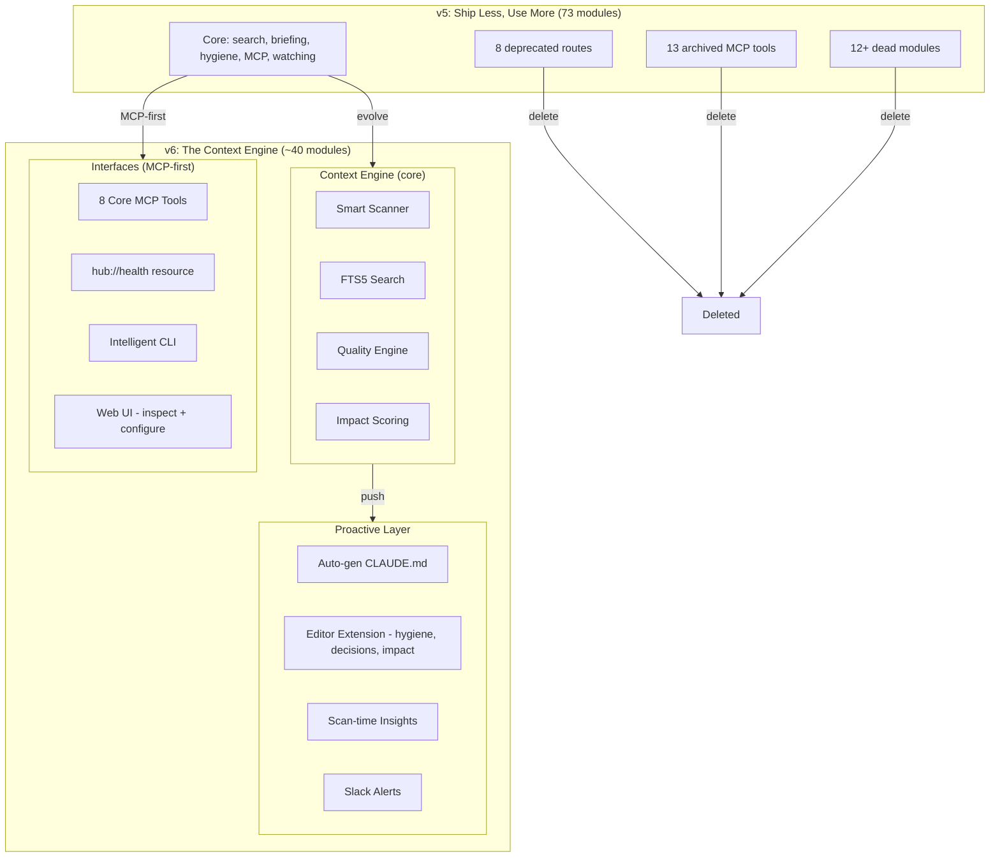

# Future Developments — v6: The Context Engine

Five versions shipped. 134 PRs. 1,152 tests. 73 lib modules. The Hub went from file browser (v1) to feature explosion (v2) to polish (v3) to agent intelligence (v4) to cleanup (v5). This document is the strategy for v6.

---

## The Honest Retrospective

### What v1–v5 revealed

After 5 versions, the pattern is clear: **the web UI is not the product. The context layer is.**

Evidence:
- The 5 features that survived all versions are infrastructure, not UI: search indexing, file watching, config simplicity, hygiene detection, MCP tools
- The web UI features that get used (Cmd+K search, briefing page) are entry points to data, not destinations themselves
- The MCP server is the interface with the most leverage — AI assistants use it without a browser
- Every "platform" feature (SSO, federation, marketplace, sharing) had 0 adoption
- Every "agent intelligence" feature (memory, sessions, change pipeline) had 0 invocations in production
- v5 acknowledged this ("ship less, use more") but archived/deprecated instead of deleting

### What the numbers mean

| Metric | Count | Honest Assessment |
|---|---|---|
| Lib modules | 73 | ~30 carry real weight. ~20 are partially scaffolded. ~23 should be deleted. |
| API routes | 71 | ~25 are core. ~20 are feature-specific. ~26 are unused or deprecated. |
| Components | 52 | ~25 are essential. ~15 are feature-specific. ~12 are scaffolding. |
| MCP tools | 19 (6 core) | 6 core tools are the product. 13 archived tools should be deleted. |
| Tests | 1,152 | Broad but shallow. Most test existence, not behavior. |

### The uncomfortable truth

The Hub has 3x more code than it needs. v5 said "cut the dead weight" but added deprecation headers instead of deleting routes, archived tools instead of removing them, and inventoried modules instead of consolidating them. The codebase is still carrying the weight of every ambitious idea from v2–v4.

---

## The v6 Thesis

> **The Hub is not a web app. It's a context engine that makes AI assistants smarter about your workspace.**

The web UI exists to configure and inspect the engine. The MCP server is the primary interface. The value prop is: "Point it at your directories. Your AI tools instantly understand your entire workspace."

Three principles:

1. **Delete more than you add.** Target: 73 → 40 modules. 71 → 35 routes. 52 → 30 components.
2. **MCP-first, web-second.** Every new capability should be an MCP tool first, web UI second.
3. **Proactive, not passive.** Don't wait for the user to visit a page. Push context to where they already are.

---

## v6 Evolution: 4 Pillars

### Pillar 1: The Great Deletion

v5 deprecated. v6 deletes. Remove every line of code that doesn't serve the context engine.

**Actions:**

| Target | Current | v6 Target | What to cut |
|---|---|---|---|
| Lib modules | 73 | ~40 | Delete federation, sharing, marketplace, context-manager, SSO, plugin-sandbox, governance, agent-memory, session-tracker, change-pipeline, smart-summary, meeting-briefing (as standalone), config-client (already merged) |
| API routes | 71 | ~35 | Delete all 8 deprecated routes (federation, sharing, contexts, marketplace, agent-memory, pipeline, gaps, meeting-brief). Delete scaffolding routes (sso, proxy, onboarding as API). |
| MCP tools | 19 | 8 | Delete archived tools directory. Keep 6 core + promote `get_hygiene` and `get_trends` to core. |
| Components | 52 | ~35 | Delete scaffolding components (federation UI, sharing UI, marketplace UI if any). Consolidate panel renderers. |
| Tests | 1,152 | ~800 quality | Delete existence-check tests. Keep integration and behavioral tests. Add coverage for real user flows. |

**Deletion criteria:** If a module has 0 callers outside its own API route and 0 MCP tool consumers, delete it.

### Pillar 2: MCP as the Primary Interface

The MCP server should be the best way for AI assistants to understand a workspace. Today it wraps API calls. Tomorrow it should be intelligent.

**Features:**

1. **Workspace summary tool** — One-call overview: "Here's what this workspace is about, how it's organized, what's changed recently, and what needs attention." No AI assistant should need to call 4 tools to get oriented.

2. **Contextual search** — Today: keyword search returns file matches. Tomorrow: "Find me everything related to the pricing decision we made last month" returns a synthesized answer with decision context, related docs, and timeline.

3. **Write-back tools** — Today: MCP is read-only (except `remember`). Add: `create_doc` (create a new document from template), `update_artifact` (append/edit content), `mark_reviewed` (update hygiene status). Let AI assistants not just read but contribute to the workspace.

4. **Workspace health as a resource** — Expose `hub://health` as an MCP resource that includes: hygiene score, stale doc count, recent changes, knowledge graph density. AI assistants can check this proactively.

5. **Smart context windows** — When an AI assistant asks for context about a topic, The Hub should return optimally-sized context: not too much (token waste), not too little (missing info). Use the existing impact scoring to prioritize what matters.

### Pillar 3: Proactive Intelligence

Stop waiting for the user to visit a page. Push insights to where they already are.

**Features:**

1. **Auto-generated context files** — The Hub already scans for `CLAUDE.md` and `.cursorrules` in repos. Flip the direction: The Hub *generates* a workspace context file on every scan. Contents: workspace overview, stale docs, recent decisions, hygiene warnings, key artifacts. Every AI assistant (Claude Code, Cursor, Copilot) already reads these files natively. Zero extension to install. Zero friction. The Hub becomes invisible infrastructure that enriches the context AI tools already consume.

2. **Editor extension (complementing, not duplicating)** — Cursor and VS Code have file search, git, AI chat, and MCP. They do NOT have persistent cross-workspace intelligence. The extension surfaces what editors can't compute on their own:
   - **Hygiene warnings** — "This doc has 2 near-duplicates", "Stale: 90 days without update", "Contradicts decision in pricing-v3.md" — shown in a sidebar panel when viewing any indexed file
   - **Decision context** — "3 decisions reference this area" with links to source docs — extracted from Hub's decision graph, not available via grep
   - **Impact preview** — "Changing this affects 5 stakeholders" — requires Hub's activity tracking + impact scoring over time
   - **Knowledge graph navigation** — "4 docs link to this, 2 depend on it" — backlinks and typed relationships from Hub's persistent graph
   - **Cross-workspace search** — Search ALL indexed workspaces, not just the open project. Cursor only sees the current folder.
   - **Workspace health** — Quality score, staleness trend sparklines, hygiene badge count in the status bar

   What this is NOT: not file search (Cmd+P exists), not git (built-in), not AI chat (Claude/GPT built-in), not MCP tools (already consumed natively). Purely the persistent, temporal, cross-workspace layer.

3. **Slack proactive alerts** — Not just weekly digests. Real-time alerts for: "Document X contradicts document Y" (detected during scan), "Meeting in 2 hours — here's context for 3 docs you'll discuss" (calendar + context compilation), "5 docs haven't been updated in 90 days — here's which ones matter" (decay + impact scoring).

4. **CLI intelligence** — `hub context` before a meeting. `hub stale` to see what needs attention. `hub search <query>` with AI-enhanced results. Make the CLI a first-class citizen, not an afterthought.

5. **Scan-time insights** — When a file changes, The Hub should know if that change matters. "pricing.md changed — this affects 3 decisions and 2 stakeholders." Wire the existing impact scoring and decision tracking into the scan pipeline so insights are computed eagerly, not lazily.

### Pillar 4: Content Quality Engine

Go from "find docs" to "keep docs good." The hygiene analyzer works. Make it the core differentiator.

**Features:**

1. **Hygiene-as-code** — Define hygiene rules in hub.config.ts: "docs older than 90 days in /decisions/ must be reviewed", "no two docs in /specs/ should have >80% similarity", "every doc in /runbooks/ must have a last-reviewed date." Custom rules, not just built-in heuristics.

2. **Auto-fix suggestions** — Today hygiene says "these 2 docs are duplicates." Tomorrow it says "here's the merged version" with a diff preview. Use AI to generate merge suggestions, not just detection.

3. **Doc lifecycle tracking** — Formal states: draft → active → stale → archived. Transitions triggered by rules (staleness threshold, review completion, superseded-by relationship). Visible in the UI and queryable via MCP.

4. **Quality score** — Every artifact gets a quality score: freshness, completeness (has title, has content, has metadata), link health (outbound links resolve), consistency (doesn't contradict other docs). Aggregated to workspace-level health metric.

---

## v6 Technical Roadmap

### Phase 1: Delete (Reduce surface area)

| # | Item | Impact | Effort |
|---|---|---|---|
| 1 | ✅ Delete deprecated API routes (federation, sharing, contexts, marketplace, agent-memory, pipeline, gaps, meeting-brief) | High | Low |
| 2 | ✅ Delete unused lib modules (federation, sharing, marketplace, context-manager, SSO, plugin-sandbox, governance) | High | Medium |
| 3 | ✅ Delete archived MCP tools directory — remove code, not just archive | Medium | Low |
| 4 | ✅ Delete agent-memory, session-tracker, change-pipeline, smart-summary modules | Medium | Low |
| 5 | ✅ Consolidate remaining modules — merge small utilities, reduce public API surface | Medium | High |

### Phase 2: MCP-First (Make the context engine exceptional)

| # | Item | Impact | Effort |
|---|---|---|---|
| 6 | ✅ Workspace summary MCP tool — single-call workspace orientation | Very High | Medium |
| 7 | ✅ Write-back MCP tools (create_doc, update_artifact, mark_reviewed) | High | Medium |
| 8 | ✅ Smart context windows — optimally-sized context based on topic + impact scoring | High | High |
| 9 | ✅ Promote get_hygiene and get_trends to core MCP tools | Medium | Low |
| 10 | ✅ hub://health MCP resource — workspace health summary | Medium | Low |

### Phase 3: Proactive (Push context to where users are)

| # | Item | Impact | Effort |
|---|---|---|---|
| 11 | ✅ Auto-generated context files — CLAUDE.md / .cursorrules written on every scan with workspace state | High | Medium |
| 12 | ✅ Editor extension — hygiene warnings, decision context, impact preview, knowledge graph, cross-workspace search (only what Cursor lacks) | Very High | High |
| 13 | ✅ Scan-time insight computation — eager impact/decision analysis on file changes | High | Medium |
| 14 | ✅ Slack proactive alerts — contradiction detection, meeting prep, decay alerts | Medium | Medium |
| 15 | ✅ CLI upgrade — `hub context`, `hub stale`, AI-enhanced `hub search` | Medium | Medium |

### Phase 4: Quality Engine (Make hygiene the differentiator)

| # | Item | Impact | Effort |
|---|---|---|---|
| 16 | ✅ Hygiene-as-code — custom rules in hub.config.ts | High | High |
| 17 | ✅ Auto-fix suggestions — AI-generated merge diffs for duplicates | High | Medium |
| 18 | ✅ Doc lifecycle states (draft → active → stale → archived) with transition rules | Medium | Medium |
| 19 | ✅ Quality score per artifact + workspace-level health metric | Medium | Medium |

---

## What to Delete (Specific)

### Modules to delete entirely

| Module | Lines | Reason |
|---|---|---|
| `federation.ts` | ~150 | 0 users, deprecated in v5 |
| `sharing.ts` | ~120 | 0 users, deprecated in v5 |
| `marketplace.ts` | ~200 | 0 community plugins |
| `context-manager.ts` | ~66 | Use workspaces instead |
| `sso.ts` | ~87 | 0 enterprise users |
| `plugin-sandbox.ts` | ~150 | Overly complex for 1 plugin |
| `governance.ts` | ~100 | Enterprise scaffolding |
| `agent-memory.ts` | ~180 | 0 invocations in production |
| `session-tracker.ts` | ~150 | Nobody calls catch_up |
| `change-pipeline.ts` | ~120 | Never triggered |
| `smart-summary.ts` | ~100 | Never integrated |
| `config-client.ts` | ~23 | Already merged into config.ts |
| **Total** | **~1,446** | |

### API routes to delete

All 8 routes currently marked deprecated in `deprecation.ts`:
- `/api/federation`, `/api/sharing`, `/api/contexts`, `/api/marketplace`
- `/api/agent-memory`, `/api/pipeline`, `/api/gaps`, `/api/meeting-brief`

Plus: `/api/sso`, `/api/proxy` (unused)

### MCP archived tools to delete

Remove `src/mcp/archived/` directory entirely. The 13 archived tools are dead code.

---

## Architecture: v5 → v6

---

## Success Metrics

v6 success is measured by **context utility**, not feature count:

| Metric | v5 | v6 Target | How to Measure |
|---|---|---|---|
| Lib modules | 73 | < 45 | File count |
| API routes | 71 | < 40 | Route count |
| MCP tools (core) | 6 | 8 | Server registration |
| MCP invocations/day | Unknown | Trackable | Log tool calls with timestamps |
| Codebase size | ~15K LOC | < 10K LOC | cloc |
| Search p95 | < 50ms (target) | < 30ms | Benchmark suite |
| Time to workspace orientation (MCP) | 4+ tool calls | 1 tool call | workspace_summary response |
| Hygiene rules (configurable) | 7 built-in | 7 built-in + N custom | Config count |
| Auto-generated context files | 0 | 1 per workspace | File exists + freshness |
| Editor extension | 0 | Installed locally | Surfaces hygiene/decisions/impact in sidebar |

---

## What v6 is NOT

- **Not a team tool.** Still personal. Multi-user is a different product.
- **Not a Notion/Obsidian replacement.** The Hub indexes docs. It doesn't author them (except via AI write-back tools).
- **Not a platform.** No plugins, no marketplace, no federation. Those are deleted.
- **Not AI-dependent.** Core features (search, hygiene, file watching) work without any AI. AI enhances, doesn't gate.

---

## The Pitch (v6)

> "The Hub is a local context engine for your workspace. It indexes your docs, keeps them healthy, and gives your AI tools deep understanding of your work — via MCP, CLI, or browser."

The web UI is a window into the engine. The MCP server is the engine's voice. The CLI is the engine's hands. The engine itself is: scan → index → analyze → serve context.
