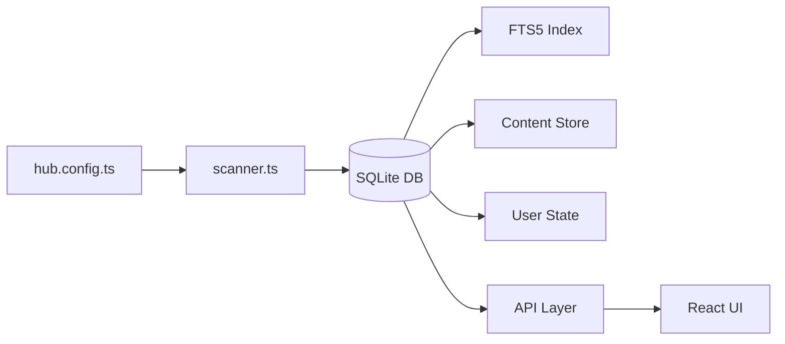
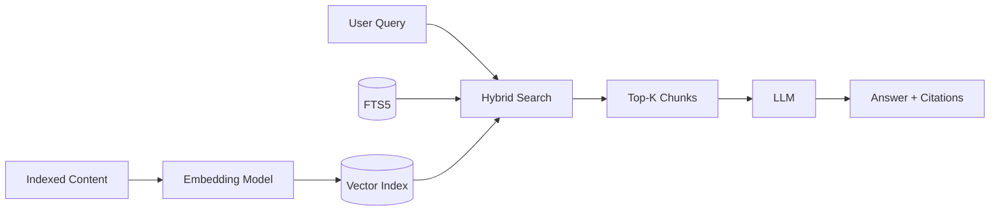
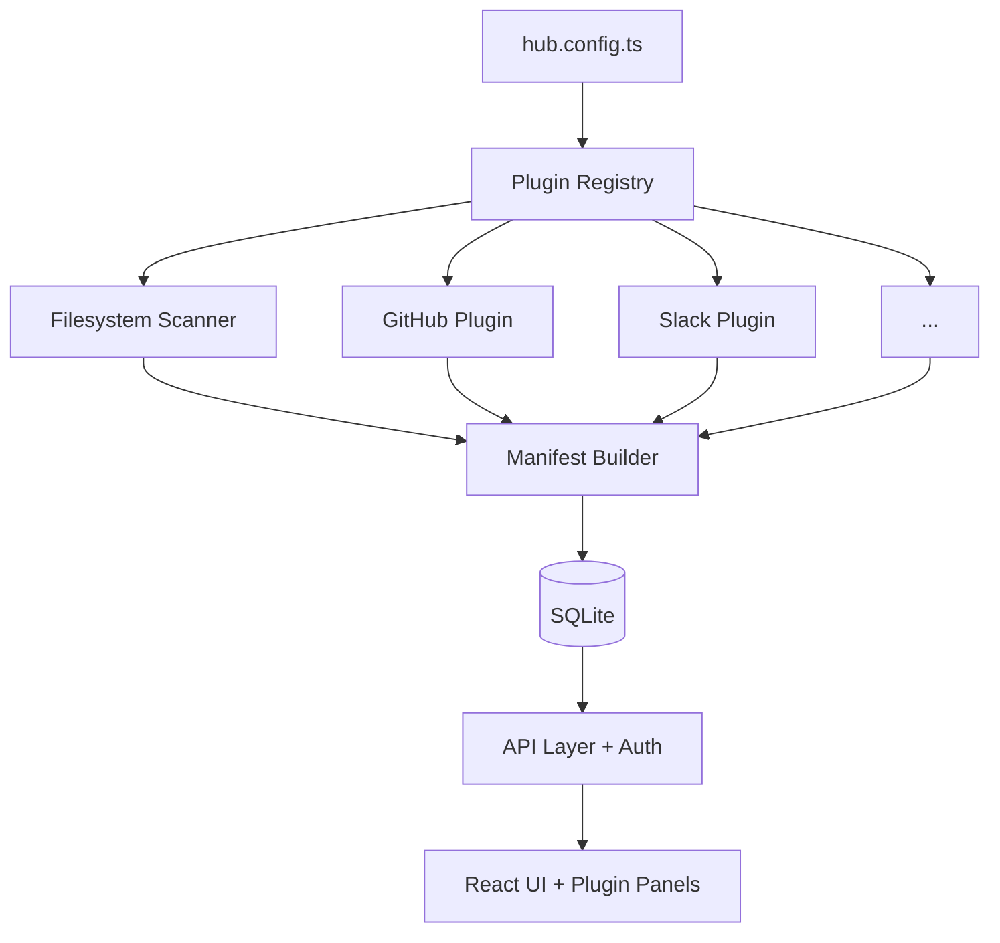

# Future Developments

The Hub is a config-driven personal command center that scans local directories, groups files into tabs, and provides a unified knowledge interface. This document charts its evolution into a world-class knowledge platform.

## Vision

**The Hub becomes the control plane for knowledge workers operating across fragmented tools.** Not a replacement for any tool — the connective tissue between all of them. What a terminal is to a developer, The Hub is to a PM, EM, staff engineer, or founder.

**Core principle**: Launchpad, not destination. The Hub indexes, orients, and dispatches — it doesn't try to become the editor, the wiki, or the project tracker.

**Ideal users**: Product Managers, Staff/Principal Engineers, Engineering Managers, Technical Writers, Founders.

---

## Phased Feature Roadmap

### Phase 1: Foundation (0–3 months) — "10x the core"

| Feature | Why | Key Change |
|---|---|---|
| **Full-text search (SQLite + FTS5)** | Current search only matches metadata. Most content is invisible. #1 gap. | Add `better-sqlite3`, index full content at scan time, new `/api/search`, upgrade Cmd+K to server-side search |
| **Expanded file types** | Only md/html/svg/csv today. Missing PDF, docx, txt, json, yaml, code files. | Refactor scanner into a renderer/extractor registry. Add `pdf-parse`, `mammoth` for PDF/docx. |
| **Content diffs in change feed** | Change feed shows binary "modified" — useless without knowing *what* changed. | Store content hashes in SQLite, compute word-level diffs for markdown. |
| **Configurable repo depth** | 2-level scan misses monorepo nested packages. | Add `scanner.repoDepth` to config. Extract richer git metadata. |
| **New panel types** | 7 fixed panel types limit curation. | Add `chart`, `checklist`, `custom` panel types. |

### Phase 2: Intelligence (3–9 months) — "AI multiplies the value"

| Feature | Why | Key Change |
|---|---|---|
| **Semantic search (embeddings)** | FTS finds keywords. Semantic search finds meaning. | Hybrid ranking: FTS5 score + cosine similarity via `sqlite-vec`. |
| **AI summarization pipeline** | Raw snippets on cards are noisy. AI summaries are 10x more useful. | Shared `ai-client.ts` module with streaming via SSE. |
| **AI-narrated briefing** | The morning briefing is manual. AI can narrate it. | "3 docs updated in Strategy. The pricing proposal now includes enterprise tiers." |
| **Workspace Q&A (RAG)** | Natural language Q&A is the killer feature. | RAG: query → semantic search → top-K chunks → LLM → answer with citations. |
| **AI hygiene recommendations** | Current hygiene flags issues. AI should prescribe actions. | Auto-classify findings. Suggest consolidation plans with merged drafts. |
| **Local model support (Ollama)** | Privacy-preserving AI without cloud API keys. | AI provider abstraction. Zero-cost, zero-cloud option. |

### Phase 3: Platform (9–18 months) — "Others build on it"

| Feature | Why | Key Change |
|---|---|---|
| **Plugin/extension system** | Every integration as core code is unsustainable. | `HubPlugin` interface with lifecycle hooks. Plugins contribute panel types, file handlers, search providers, virtual artifacts. |
| **Virtual artifacts** | Hub only indexes filesystem. Plugins should contribute from GitHub, Notion, Slack. | Manifest builder accepts contributions from multiple sources. Universal knowledge aggregator. |
| **Webhook/event system** | Enable automation: "When a new doc is added, post to Slack." | Hub emits events. External systems subscribe via config. |
| **API authentication** | Required for shared or cloud deployment. | Optional API key + token-based session auth. |

### Phase 4: Network (18+ months) — "Distribution and network effects"

| Feature | Why | Key Change |
|---|---|---|
| **Shared Hub instances** | Teams pointing at shared workspaces. | Read-only for consumers, write for owners. |
| **Hub-to-Hub linking** | Each person runs their own Hub. Hubs discover each other. | Cross-Hub search. Genuine network effect. |
| **Cloud-hosted option** | Not everyone wants to self-host. | Hosted service with cloud storage connectors. |
| **Template/plugin marketplace** | Config templates and community plugins. | Hub transitions from tool to platform. |

---

## Technical Architecture Evolution

### Phase 1: SQLite Foundation

### Phase 2: AI Pipeline

### Phase 3: Plugin Architecture

### Architectural Principles

1. **SQLite is the backbone** — every piece of state flows through it
2. **Local-first, cloud-optional** — filesystem scanner is primary, cloud connectors are plugins
3. **AI is a layer, not a dependency** — every feature works without AI
4. **Config remains king** — `hub.config.ts` is the power-user interface

---

## Integrations

### Tier 1 — High value, low effort

| Integration | Mechanism | Value |
|---|---|---|
| **GitHub/GitLab** | REST API plugin | PR status, issue counts on repo cards |
| **Linear** | REST API plugin | Sprint status panel, issue linking |
| **Slack** | Webhook receiver | Post change feed summaries to channels |
| **Claude/GPT/Ollama** | AI provider | Summarization, Q&A, embeddings |

### Tier 2 — Medium effort, high value

| Integration | Mechanism | Value |
|---|---|---|
| **Notion** | API connector plugin | Index Notion pages as virtual artifacts |
| **Google Docs** | API connector plugin | Index shared docs without filesystem presence |
| **Confluence** | API connector plugin | Enterprise wiki integration |
| **Calendar** | API plugin | Upcoming meetings in briefing |

### Tier 3 — Platform play

| Integration | Mechanism | Value |
|---|---|---|
| **Grafana** | Embed panel | Metrics alongside docs |
| **Email** | Plugin | Surface relevant threads |
| **Datadog/PagerDuty** | Plugin | Incident context in briefing |

---

## Distribution Channels

| Channel | Timeline | Rationale |
|---|---|---|
| **Open source on GitHub** | Now | Builds credibility, attracts contributors, validates demand |
| **Editor extensions** | Phase 1 | VS Code, JetBrains, Zed (Cursor extension already exists) |
| **Raycast extension** | Phase 1 | Cmd+K search without opening browser |
| **Tauri desktop app** | Phase 2 | Native app experience (~5MB vs Electron's 100MB+) |
| **CLI tool** | Phase 2 | `hub search`, `hub open`, `hub status` from terminal |
| **Homebrew formula** | Phase 2 | `brew install the-hub` |
| **Cloud hosted** | Phase 4 | Freemium SaaS for non-self-hosters |

---

## Partnerships & Ecosystem

| Partner | Type | Value |
|---|---|---|
| **Cursor/Anysphere** | Distribution | First-class Cursor extension. Audience overlap. |
| **Anthropic** | AI provider | Claude as default backend. MCP server integration. |
| **Vercel** | Hosting | One-click deploy template. |
| **Raycast** | Distribution | Raycast store extension. |
| **Obsidian community** | Ecosystem | Hub as companion (indexes + surfaces, Obsidian edits). |

**MCP opportunity**: The Hub could expose itself as an MCP server. Any AI assistant (Claude, Cursor, Windsurf) could query your Hub's knowledge base — making it the knowledge backend for all your AI tools.

---

## Competitive Positioning

| vs. | The Hub's advantage |
|---|---|
| **Obsidian** | Indexes across all repos/tools, not just one vault. Editor-agnostic. |
| **Notion** | Local-first, no cloud dependency. Hub indexes Notion, not the reverse. |
| **Raycast** | Raycast is the action layer, Hub is the knowledge layer. Complementary. |
| **Backstage** | Personal-scale, zero-config vs team-scale infrastructure. |
| **Dendron** | Editor-agnostic, multi-format vs VS Code + markdown only. |

### Defensible Moat

1. **Config-driven simplicity** — one file defines everything
2. **Local-first** — zero cloud required, resonates in the data-privacy era
3. **Editor-native** — lives where developers already work
4. **AI-augmented, not AI-dependent** — every feature works without AI
5. **Plugin composability** — community builds the long tail of integrations

---

## Business Model

### Open Source Core (always free)
Filesystem scanning, grouping, full-text search, markdown rendering, briefing, hygiene, repos, Cmd+K, context compiler, editor extensions, CLI

### Premium ($12/month individual)
AI features (semantic search, summarization, Q&A, AI briefing), advanced integrations (Notion, Confluence, Google Docs), cloud sync

### Team ($30/user/month)
Shared Hub instances, access control, SSO, audit logging

### Marketplace (70/30 revenue share)
Community plugins, config template packs

**Monetization boundary**: AI features have marginal cost (API calls) — natural paywall. Filesystem features stay free forever.

---

## 90-Day Execution Plan

| Weeks | Deliverable |
|---|---|
| **1–3** | SQLite data layer + FTS5 full-text search |
| **4–6** | Expanded file types + content diffs in change feed |
| **7–9** | AI client abstraction + document summarization + AI briefing |
| **10–12** | Semantic search with embeddings + workspace Q&A (RAG) |

---

## Risks & Mitigations

| Risk | Mitigation |
|---|---|
| SQLite adds native dependency | `better-sqlite3` is battle-tested (Obsidian, Linear use it). Keep as only native dep. |
| AI features require API keys + cost | Always provide no-AI fallback. Support Ollama for zero-cost local operation. |
| Plugin system maintenance burden | Strict interface, sandboxed execution, validated output. |
| Scope creep toward "another Notion" | Hold the line: launchpad, not destination. Hub sends you elsewhere to work. |
| Performance with large workspaces | SQLite handles millions of rows. Incremental indexing. 5s debounce already in place. |
