# Future Developments — v5: Ship Less, Use More

Four versions shipped. 118 PRs. 1,048 tests. 69 lib modules. 19 MCP tools. The Hub went from file browser (v1) to feature explosion (v2) to polish (v3) to agent intelligence (v4). This document is about what we learned — and the uncomfortable truth about what to do next.

---

## The Honest Retrospective

### What survived four versions

After building everything, **five things actually matter**:

1. **Fast search** (Cmd+K) — FTS5 indexing works. Users find docs. This is the core value.
2. **Morning briefing** — The daily entry point. Change feed, stale detection, pinned artifacts.
3. **Hygiene reports** — Duplicate detection, staleness. Catches documentation debt.
4. **MCP core tools** — `search`, `read_artifact`, `ask_question`, `get_manifest`, `list_groups`. Agents use these.
5. **File watching + config simplicity** — One config file, auto-updates. It just works.

### What didn't survive

| Feature | Shipped | Used | Verdict |
|---|---|---|---|
| Agent memory (remember/recall) | v4 | Never invoked in production | Dead infrastructure |
| Session tracking (catch_up) | v4 | Tool exists, nobody calls it | Theoretical |
| Change pipeline | v4 | Code exists, never triggered | Dead code |
| Notifications | v4 | DB table exists, no UI, no triggers | Scaffolding |
| Weekly digest / Slack | v4 | API-only, no scheduling | On-demand only |
| Meeting briefings | v4 | No calendar wired, no schedule | Half-built |
| Knowledge gap detection | v4 | Tool exists, low usage | Niche |
| Smart change summaries | v4 | Never integrated into briefing | Orphaned |
| Impact scoring | v2 | API exists, no UI surfaces it meaningfully | Invisible |
| Federation | v2 | 0 users linking Hubs | Dead |
| Plugin marketplace | v2 | 0 community plugins | Dead |
| Enterprise SSO | v2 | 0 enterprise users | Over-built |
| 13 of 19 MCP tools | v3-v4 | Only 5-6 are invoked by agents | Feature bloat |

### What the numbers really mean

| Metric | Count | Meaningful |
|---|---|---|
| Lib modules | 69 | ~40 carry weight, ~29 are scaffolding |
| API routes | 70 | ~35 are used, ~35 are undiscoverable |
| MCP tools | 19 | 5-6 are valuable, rest are noise |
| Tests | 1,048 | ~200 are integration-level, rest are existence checks |
| PRs | 118 | ~50 delivered lasting value |

---

## The v5 Thesis

> **Stop building. Start using. Measure what matters. Delete what doesn't.**

v5 is not a feature roadmap. It's a **quality and adoption** roadmap. The goal: make the 5 things that work into a 10/10 product, wire the 3 things that almost work into real automation, and delete the rest.

---

## v5 Evolution: 3 Pillars

### Pillar 1: Make What Works Exceptional

The core 5 features work. Make them undeniably great.

**Features:**
- **Search speed target: < 50ms p95** — Profile FTS5 queries, add result caching, optimize for common patterns
- **Briefing page as the home screen** — First load < 500ms, show everything important in one glance (no click-to-expand)
- **Hygiene auto-run on scan** — Don't wait for user to visit /hygiene. Run on every scan, badge count on sidebar
- **MCP tool response time < 100ms** — Profile the 5 core tools, pre-cache common queries
- **Preview panel polish** — Instant content loading, keyboard navigation (j/k for next/prev artifact)
- **Offline-capable PWA** — Cache manifest + recent searches for offline browsing

### Pillar 2: Wire the Automation (For Real This Time)

Three v4 features almost work but lack triggers. Wire them properly.

**Features:**
- **Scheduled weekly digest** — Cron job (not manual API call) that generates and posts to Slack. Actually wire `SLACK_WEBHOOK_URL` → `postWeeklyDigest()`. Test with real Slack workspace.
- **Calendar-driven briefings** — Wire `CALENDAR_URL` → `fetchCalendarEvents()` → `compileContext()` → show on briefing page. Actually parse iCal and display today's meetings.
- **Notification delivery** — When a review is completed or annotation added, actually call `notify()`. Show notification count badge on sidebar. Simple inbox page.

### Pillar 3: Cut the Dead Weight

Delete or deprecate features that aren't used. Reduce cognitive load.

**Actions:**
- **Archive 13 unused MCP tools** — Keep: search, read_artifact, ask_question, get_manifest, list_groups, get_decisions. Archive the rest to `src/mcp/archived/`.
- **Mark dead API routes as deprecated** — Add `X-Deprecated` header to routes nobody hits. Remove in v5.1.
- **Consolidate lib modules** — 69 modules → target 45. Merge small single-function modules.
- **Upgrade test quality** — Replace 100 existence-check tests with 20 integration tests that test real user flows.
- **Remove from marketing**: Federation, SSO, plugin marketplace, enterprise tiers.

---

## v5 Technical Roadmap

### Phase 1: Core Excellence (Make the 5 great things exceptional)

| # | Feature | Pillar | Impact | Effort |
|---|---|---|---|---|
| ✅ 1 | Search result caching (< 50ms p95 target) | Excellence | Very High | Medium |
| ✅ 2 | Briefing page first-load optimization (< 500ms) | Excellence | High | Medium |
| ✅ 3 | Hygiene auto-run on scan with sidebar badge | Excellence | High | Low |
| ✅ 4 | MCP core tool profiling + caching (< 100ms) | Excellence | High | Medium |
| ✅ 5 | Preview keyboard navigation (j/k, Esc) | Excellence | Medium | Low |

### Phase 2: Real Automation (Wire what almost works)

| # | Feature | Pillar | Impact | Effort |
|---|---|---|---|---|
| ✅ 6 | Scheduled Slack weekly digest (actual cron) | Automation | High | Medium |
| ✅ 7 | Calendar-driven briefings (wire iCal → briefing page) | Automation | High | Medium |
| ✅ 8 | Notification triggers (review/annotation → notify → badge) | Automation | Medium | Medium |
| ✅ 9 | Notification inbox page | Automation | Medium | Low |
| ✅ 10 | Auto-hygiene badge on sidebar (run on every scan) | Automation | Medium | Low |

### Phase 3: Cleanup (Delete what doesn't work)

| # | Feature | Pillar | Impact | Effort |
|---|---|---|---|---|
| ✅ 11 | Archive 13 unused MCP tools to archived/ | Cleanup | Medium | Low |
| ✅ 12 | Deprecate unused API routes (X-Deprecated header) | Cleanup | Low | Low |
| ✅ 13 | Consolidate lib modules (69 → 45 target) | Cleanup | Medium | High |
| ✅ 14 | Upgrade 100 weak tests to 20 integration tests | Cleanup | High | High |
| ✅ 15 | Remove dead features from README/landing page | Cleanup | Medium | Low |

---

## What to Delete

| Feature | Location | Action |
|---|---|---|
| Agent memory (remember/recall) | `src/lib/agent-memory.ts`, MCP tools | Archive — no adoption path |
| Session tracker (catch_up) | `src/lib/session-tracker.ts`, MCP tool | Archive — nobody calls it |
| Change pipeline | `src/lib/change-pipeline.ts` | Delete — never triggered |
| Smart summaries | `src/lib/smart-summary.ts` | Archive — never integrated |
| Knowledge gaps | `src/lib/knowledge-gaps.ts`, MCP tool | Archive — niche |
| Meeting briefing | `src/lib/meeting-briefing.ts`, MCP tool | Keep lib, archive MCP tool |
| Context compiler MCP tool | MCP compile_context | Archive — use via API only |
| Impact scoring MCP tool | MCP get_impact | Archive — API sufficient |
| Federation | `src/lib/federation.ts` | Deprecate |
| Plugin marketplace | `src/lib/marketplace.ts` | Deprecate |
| Enterprise SSO | `src/lib/sso.ts` | Deprecate |

---

## Architecture: v4 → v5

```mermaid
flowchart TD
    subgraph v4["v4: Agent Intelligence (69 modules)"]
        AgentMem[Agent Memory]
        SessionTrack[Session Tracker]
        ChangePipeline[Change Pipeline]
        SmartSummary[Smart Summary]
        KnowledgeGaps[Knowledge Gaps]
        Notifications[Notifications - no UI]
        Digest[Digest - no schedule]
        MeetingBrief[Meeting Brief - no calendar]
        Plus13[+13 unused MCP tools]
    end

    subgraph v5["v5: Ship Less, Use More (~45 modules)"]
        FastSearch[Search < 50ms]
        FastBriefing[Briefing < 500ms]
        AutoHygiene[Auto Hygiene + Badge]
        SlackDigest[Real Slack Digest - cron]
        CalBriefing[Real Calendar Briefing]
        NotifInbox[Notification Inbox]
        CoreMCP[6 Core MCP Tools]
    end

    v4 -->|cut 40%| v5
    AgentMem -->|archive| Deleted[Archived]
    SessionTrack -->|archive| Deleted
    ChangePipeline -->|delete| Deleted
    SmartSummary -->|archive| Deleted
    KnowledgeGaps -->|archive| Deleted
    Plus13 -->|archive| Deleted
    Notifications -->|wire triggers| NotifInbox
    Digest -->|add cron| SlackDigest
    MeetingBrief -->|wire calendar| CalBriefing
```

**Key shift:** From "build more" to "use what's built." Measure. Delete. Polish.

---

## Success Metrics

v5 success is measured by **adoption**, not feature count:

| Metric | Current | v5 Target | How to Measure |
|---|---|---|---|
| Search p95 latency | ~150ms | < 50ms | Benchmark suite |
| Briefing first load | ~1s | < 500ms | Lighthouse |
| MCP tool invocations/day | Unknown | Measurable | Session tracker (keep this one) |
| Hygiene findings acted on | Unknown | > 50% | Track archive/delete actions |
| Slack digest sent/week | 0 | 1 | Scheduled job success |
| Notification delivery rate | 0% | > 80% | Notify calls / trigger events |
| Lib modules | 69 | < 50 | File count |
| MCP tools | 19 | 6 | Server registration |
| Meaningful test coverage | ~20% | > 60% | Integration test ratio |

---

## The Pitch (Updated)

> "The Hub is a personal workspace search engine that runs locally, keeps your docs healthy, and gives your AI tools context — all from one config file."

Not an agent memory platform. Not an enterprise tool. Not a Notion replacement. A fast, reliable search engine with hygiene intelligence and MCP access. That's the product.
