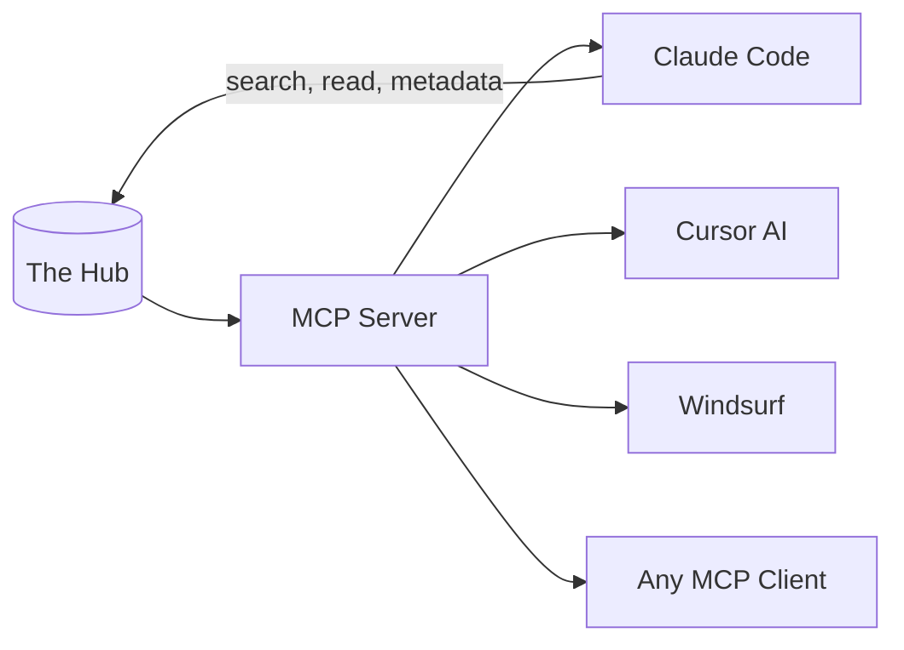
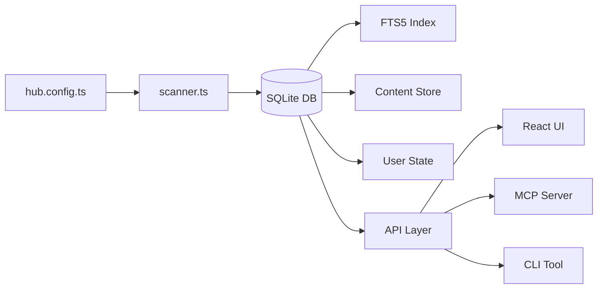
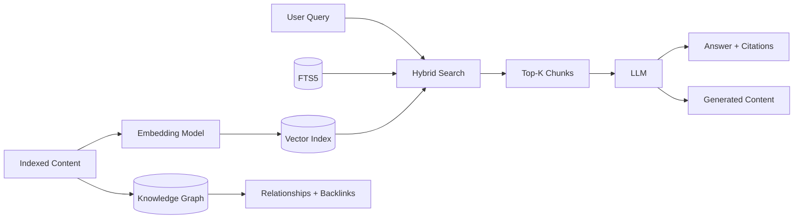
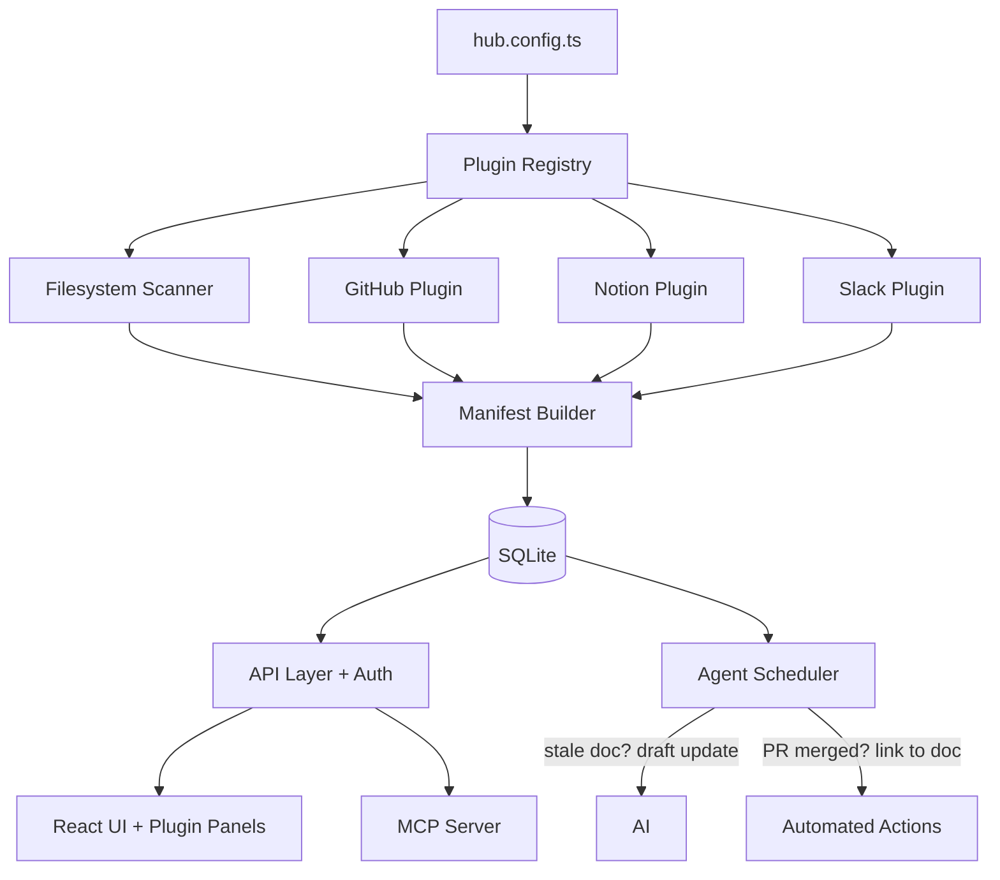
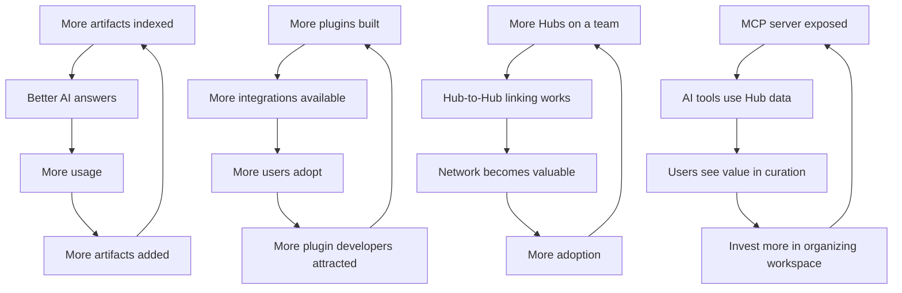

# Future Developments

The Hub is a config-driven personal command center that scans local directories, groups files into tabs, and provides a unified knowledge interface. This document charts its evolution from a personal tool into a world-class knowledge platform.

---

## Vision

**The Hub becomes the control plane for knowledge workers operating across fragmented tools.** Not a replacement for any tool — the connective tissue between all of them. What a terminal is to a developer, The Hub is to a PM, EM, staff engineer, or founder.

**Core principle**: Launchpad, not destination. The Hub indexes, orients, and dispatches — it doesn't try to become the editor, the wiki, or the project tracker.

**Ideal users**: Product Managers, Staff/Principal Engineers, Engineering Managers, Technical Writers, Founders.

---

## The Hub as Infrastructure

The biggest evolution isn't a feature — it's a reframing. The Hub should not just be a UI you visit. It should be **the knowledge API layer** that powers your entire workflow.

### MCP Server

The highest-leverage single play. Expose The Hub's indexed knowledge as an MCP (Model Context Protocol) server:

- **Claude Code** searches your workspace without you copy-pasting context
- **Cursor's AI** pulls from your curated knowledge base for inline suggestions
- **Any MCP-compatible tool** gets access to your artifact graph, search, and metadata

This turns The Hub from "a nice dashboard" into "the knowledge backend for your entire AI workflow."

### Knowledge API

- REST API with authentication for third-party integrations (16 endpoints already exist — add auth + docs)
- CLI as a first-class interface: `hub search`, `hub open`, `hub status`, `hub context`
- SDK / client library for building on top of The Hub's indexed data
- Webhooks for real-time event streaming to external systems

---

## Phased Feature Roadmap

### Phase 1: Foundation (0–3 months) — "10x the core"

| Feature | Why | Key Change |
|---|---|---|
| **Full-text search (SQLite + FTS5)** | Current search only matches metadata. Most content is invisible. #1 gap. | Add `better-sqlite3`, index full content at scan time, new `/api/search`, upgrade Cmd+K to server-side search |
| **Expanded file types** | Only md/html/svg/csv today. Missing PDF, docx, txt, json, yaml, code files. | Refactor scanner into a renderer/extractor registry. Add `pdf-parse`, `mammoth` for PDF/docx. |
| **Content diffs in change feed** | Change feed shows binary "modified" — useless without knowing *what* changed. | Store content hashes in SQLite, compute word-level diffs for markdown. |
| **MCP server (basic)** | Let AI tools query your workspace. Highest leverage. | Expose search, artifact read, and metadata via MCP protocol. |
| **Import / migration tools** | Lower the barrier to switching. | Notion export → markdown, Confluence → markdown, Obsidian vault mapping, Google Docs download, bookmarks import. |
| **New panel types** | 7 fixed panel types limit curation. | Add `chart`, `checklist`, `custom` panel types. |

### Phase 2: Intelligence (3–9 months) — "AI multiplies the value"

| Feature | Why | Key Change |
|---|---|---|
| **Semantic search (embeddings)** | FTS finds keywords. Semantic search finds meaning. | Hybrid ranking: FTS5 score + cosine similarity via `sqlite-vec`. |
| **AI summarization pipeline** | Raw snippets on cards are noisy. AI summaries are 10x more useful. | Shared `ai-client.ts` module with streaming via SSE. |
| **Content generation** | The Hub knows your context — it should help you produce, not just consume. | "Generate a status update from this week's changes." "Draft a PRD from these research docs." Template-driven generation with workspace context injection. |
| **Knowledge graph** | Artifacts are flat (file → group). No relationships between them. | Explicit links ("supersedes", "references"), AI-inferred topic overlap, backlinks, graph visualization. |
| **Workspace Q&A (RAG)** | Natural language Q&A is the killer feature. | RAG: query → semantic search → top-K chunks → LLM → answer with citations. |
| **Temporal intelligence** | Staleness is a snapshot. Time-series reveals trends. | Trend lines per group, velocity metrics, composite health scores, predictive alerts ("Knowledge group will be 80% stale by Q3"). |
| **Personalization** | The Hub treats all users identically. It should learn. | Track frequently accessed docs, navigation patterns, time-of-week habits. Predictive surfacing: "You usually check Strategy on Mondays." Gap detection from searches with no results. |
| **AI hygiene recommendations** | Current hygiene flags issues. AI should prescribe actions. | Auto-classify findings. Suggest consolidation plans with merged drafts. Proactive alerts for stale references. |
| **Local model support (Ollama)** | Privacy-preserving AI without cloud API keys. | AI provider abstraction. Zero-cost, zero-cloud option. |

### Phase 3: Platform (9–18 months) — "Others build on it"

| Feature | Why | Key Change |
|---|---|---|
| **Plugin/extension system** | Every integration as core code is unsustainable. | `HubPlugin` interface with lifecycle hooks. Plugins contribute panel types, file handlers, search providers, virtual artifacts. |
| **Agentic workflows** | Webhooks are passive. Agents are active. | Scheduled + event-driven autonomous actions: "When a doc goes stale, draft an update." "When a PR merges, link it to the planning doc." "Every Monday, generate a status update." |
| **Virtual artifacts** | Hub only indexes filesystem. Plugins should contribute from GitHub, Notion, Slack. | Manifest builder accepts contributions from multiple sources. Universal knowledge aggregator. |
| **MCP server (full)** | Complete MCP implementation with all capabilities. | Add tool definitions for search, read, write, hygiene, and metadata operations. |
| **API authentication** | Required for shared or cloud deployment. | Optional API key + token-based session auth. |

### Phase 4: Network (18+ months) — "Distribution and network effects"

| Feature | Why | Key Change |
|---|---|---|
| **Shared Hub instances** | Teams pointing at shared workspaces. | Read-only for consumers, write for owners. |
| **Hub-to-Hub linking** | Each person runs their own Hub. Hubs discover each other. | Cross-Hub search. Genuine network effect: each Hub becomes more valuable as more exist. |
| **Mobile PWA** | Knowledge workers aren't always at their desk. | Read-only Progressive Web App: morning briefing on your phone, search on the go, push notifications for stale docs. Server already runs HTTP — just needs manifest.json + service worker. |
| **Multi-workspace contexts** | Knowledge workers have multiple contexts. | "Work Hub" / "Side Project Hub" / "Learning Hub" — meta-layer to switch between them or search across all. |
| **Cloud-hosted option** | Not everyone wants to self-host. | Hosted service with cloud storage connectors. |
| **Governance / compliance** | Enterprise adoption requirement. | Document retention policies, access audit trails, compliance tagging (PII, confidential, public), automated classification via AI. |
| **Template/plugin marketplace** | Config templates and community plugins. | Hub transitions from tool to platform. |

---

## Technical Architecture Evolution

### Phase 1: SQLite Foundation

### Phase 2: AI + Knowledge Graph

### Phase 3: Plugin + Agent Architecture

### Architectural Principles

1. **SQLite is the backbone** — every piece of state flows through it
2. **Local-first, cloud-optional** — filesystem scanner is primary, cloud connectors are plugins
3. **AI is a layer, not a dependency** — every feature works without AI
4. **Config remains king** — `hub.config.ts` is the power-user interface
5. **MCP-native** — The Hub is as much an API as it is a UI

---

## Integrations

### Tier 1 — High value, low effort

| Integration | Mechanism | Value |
|---|---|---|
| **MCP Protocol** | Built-in server | Every AI tool can query your workspace |
| **GitHub/GitLab** | REST API plugin | PR status, issue counts on repo cards |
| **Linear** | REST API plugin | Sprint status panel, issue linking |
| **Slack** | Webhook receiver | Post change feed summaries to channels |
| **Claude/GPT/Ollama** | AI provider | Summarization, Q&A, generation, embeddings |

### Tier 2 — Medium effort, high value

| Integration | Mechanism | Value |
|---|---|---|
| **Notion** | API connector + import tool | Index pages as virtual artifacts, migrate content |
| **Google Docs** | API connector + import tool | Index shared docs, download as markdown |
| **Confluence** | API connector + import tool | Enterprise wiki integration |
| **Obsidian** | Import tool | Map vault structure to Hub workspaces |
| **Calendar (Google/Outlook)** | API plugin | Upcoming meetings in briefing |

### Tier 3 — Platform play

| Integration | Mechanism | Value |
|---|---|---|
| **Grafana** | Embed panel | Metrics alongside docs |
| **Email** | Plugin | Surface relevant threads |
| **Datadog/PagerDuty** | Plugin | Incident context in briefing |
| **Browser bookmarks** | Import tool | Convert bookmarks to curated link panels |

---

## Distribution Channels

| Channel | Timeline | Rationale |
|---|---|---|
| **Open source on GitHub** | Now | Builds credibility, attracts contributors, validates demand |
| **MCP server registry** | Phase 1 | List in MCP directories so AI tools can discover The Hub |
| **Editor extensions** | Phase 1 | VS Code, JetBrains, Zed (Cursor extension already exists) |
| **Raycast extension** | Phase 1 | Cmd+K search without opening browser |
| **Homebrew formula** | Phase 1 | `brew install the-hub` |
| **CLI tool** | Phase 2 | `hub search`, `hub open`, `hub status` from terminal |
| **Tauri desktop app** | Phase 2 | Native app experience (~5MB vs Electron's 100MB+) |
| **Mobile PWA** | Phase 4 | Read-only: briefing, search, notifications |
| **Cloud hosted** | Phase 4 | Freemium SaaS for non-self-hosters |

---

## Partnerships & Ecosystem

| Partner | Type | Value |
|---|---|---|
| **Anthropic** | AI + MCP | Claude as default AI backend. The Hub as a featured MCP server. |
| **Cursor/Anysphere** | Distribution | First-class Cursor extension. MCP integration for AI context. |
| **Vercel** | Hosting | One-click deploy template. |
| **Raycast** | Distribution | Raycast store extension. |
| **Obsidian community** | Ecosystem | Hub as companion (indexes + surfaces, Obsidian edits). Import tools. |

---

## Competitive Positioning

| vs. | The Hub's advantage |
|---|---|
| **Obsidian** | Indexes across all repos/tools, not just one vault. Editor-agnostic. MCP-native. |
| **Notion** | Local-first, no cloud dependency. Hub indexes Notion, not the reverse. |
| **Raycast** | Raycast is the action layer, Hub is the knowledge layer. Complementary. |
| **Backstage** | Personal-scale, zero-config vs team-scale infrastructure. |
| **Dendron** | Editor-agnostic, multi-format vs VS Code + markdown only. |

### Defensible Moat

1. **MCP-native knowledge backend** — the only tool that makes your curated workspace queryable by any AI
2. **Config-driven simplicity** — one file defines everything
3. **Local-first** — zero cloud required, resonates in the data-privacy era
4. **Editor-native** — lives where developers already work
5. **AI-augmented, not AI-dependent** — every feature works without AI
6. **Knowledge graph** — relationships between artifacts, not just a flat index
7. **Plugin composability** — community builds the long tail of integrations

---

## Compounding Flywheels

The most durable products have self-reinforcing loops. The Hub has four:

1. **Content flywheel**: More artifacts → better AI → more usage → more artifacts
2. **Plugin flywheel**: More plugins → more integrations → more users → more developers
3. **Network flywheel**: More Hubs → Hub-to-Hub linking → valuable network → more adoption
4. **MCP flywheel**: MCP exposure → AI tools use data → users curate more → richer data

---

## Business Model

### Open Source Core (always free)
Filesystem scanning, grouping, full-text search, markdown rendering, briefing, hygiene, repos, Cmd+K, context compiler, editor extensions, CLI, MCP server (basic)

### Premium ($12/month individual)
AI features (semantic search, summarization, Q&A, content generation, AI briefing), knowledge graph, temporal intelligence, personalization, advanced integrations (Notion, Confluence, Google Docs), cloud sync

### Team ($30/user/month)
Shared Hub instances, Hub-to-Hub linking, access control, SSO, audit logging, agentic workflows

### Enterprise ($80/user/month)
Governance, compliance tagging, retention policies, dedicated support, SLA, custom plugin development

### Marketplace (70/30 revenue share)
Community plugins, config template packs, import tool extensions

**Monetization boundary**: AI features have marginal cost (API calls) — natural paywall. Filesystem features and basic MCP server stay free forever.

---

## 90-Day Execution Plan

| Weeks | Deliverable |
|---|---|
| **1–3** | SQLite data layer + FTS5 full-text search |
| **4–5** | MCP server (basic: search, read artifact, list groups) |
| **6–7** | Expanded file types (PDF, txt, code) + import tools (Notion, Obsidian) |
| **8–9** | AI client abstraction + document summarization + content generation |
| **10–12** | Semantic search with embeddings + workspace Q&A (RAG) |

---

## Risks & Mitigations

| Risk | Mitigation |
|---|---|
| SQLite adds native dependency | `better-sqlite3` is battle-tested (Obsidian, Linear use it). Keep as only native dep. |
| MCP protocol is early/unstable | Implement a thin adapter layer. If MCP evolves, only the adapter changes. |
| AI features require API keys + cost | Always provide no-AI fallback. Support Ollama for zero-cost local operation. |
| Knowledge graph adds complexity | Start with explicit links only (user-defined). Inferred links come later with AI. |
| Plugin system maintenance burden | Strict interface, sandboxed execution, validated output. |
| Scope creep toward "another Notion" | Hold the line: launchpad, not destination. Hub sends you elsewhere to work. |
| Enterprise features dilute focus | Keep governance features behind the enterprise tier. Don't let compliance drive core UX. |
| Performance with large workspaces | SQLite handles millions of rows. Incremental indexing. 5s debounce already in place. |
